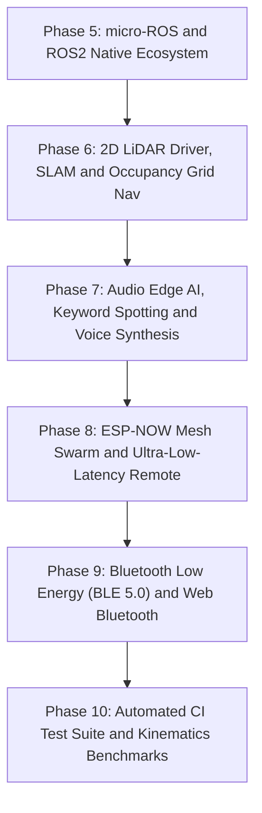

# Tamimystic OS: Master Roadmap and Architecture Blueprint

This document defines the comprehensive engineering roadmap for the next evolution of **Tamimystic OS** on the **ESP32-S3-N16R8** architecture.

---

## Master Roadmap Overview and Phased Execution

To maintain rock-solid stability, modularity, and zero regressions, these advanced subsystems are structured into 6 phased milestones:



---

## Phase 5: micro-ROS and ROS2 Native Distributed Robotics

### Objective
Integrate native **micro-ROS (Micro XRCE-DDS)** client onto ESP32-S3 to transform Tamimystic OS into a first-class ROS 2 node, enabling seamless interoperability with ROS2 Humble, Iron, and Jazzy.

### Technical Architecture
* **DDS Transport Layer**: Asynchronous UDP over Wi-Fi / Serial transport communicating with the `micro-ros-agent`.
* **Execution Model**: Dedicated FreeRTOS micro-ROS executor task running on **Core 0**.
* **Standard ROS2 Topics and Interfaces**:

| ROS2 Topic | Message Type | Direction | Rate | Description |
|---|---|---|---|---|
| `/cmd_vel` | `geometry_msgs/msg/Twist` | Subscriber | 50 Hz | Inbound velocity commands routed directly to Kinematics Engine. |
| `/odom` | `nav_msgs/msg/Odometry` | Publisher | 30 Hz | Outbound wheel odometry with dead-reckoning and covariance matrix. |
| `/joint_states` | `sensor_msgs/msg/JointState` | Publisher | 30 Hz | Live 6-DOF robotic arm joint angles ($J_1 - J_6$) and velocities. |
| `/imu/data` | `sensor_msgs/msg/Imu` | Publisher | 50 Hz | Filtered 6-axis accelerometer and gyroscope data from MPU-6050. |
| `/camera/image/compressed` | `sensor_msgs/msg/CompressedImage` | Publisher | 15 Hz | DVP camera JPEG stream for ROS2 RViz visualization. |
| `/scan` | `sensor_msgs/msg/LaserScan` | Publisher | 10 Hz | 360° distance range data from 2D LiDAR. |

---

## Phase 6: 2D LiDAR Driver, SLAM and Occupancy Grid Navigation

### Objective
Provide full autonomous mapping, SLAM (Simultaneous Localization and Mapping), and indoor obstacle path planning directly on the ESP32-S3 using an external 2D 360° LiDAR sensor.

### Technical Architecture
* **Hardware Support**: UART DMA driver for affordable 360° 2D LiDARs (RPLiDAR A1/A2, LD19 / D300, YDLidar X2/X4).
* **2D Occupancy Grid Map**:
  - Memory footprint allocated in **8MB Octal PSRAM**: $200 \times 200$ grid cells ($10\text{ m} \times 10\text{ m}$ @ $5\text{ cm/cell}$ resolution).
  - Fast Bresenham ray-casting algorithm to update cell probabilities (Free, Occupied, Unknown).
* **Real-Time Path Planning**:
  - **Global Planner**: $A^*$ (A-Star) search algorithm for optimal shortest path generation.
  - **Local Obstacle Avoidance**: Dynamic Window Approach (DWA) to steer around sudden moving obstacles.
* **Live Web Map Visualization**:
  - Real-time 2D Canvas rendering on the Web Dashboard showing the robot position, orientation heading, and live laser scan points.

---

## Phase 7: Audio Edge AI, Voice Control and Speech Synthesis

### Objective
Give Tamimystic OS voice interaction capabilities with on-device keyword recognition (wake-words) and audio voice feedback.

### Technical Architecture
* **Hardware Interface**:
  - **Audio Input**: I2S DMA driver for digital MEMS microphone (INMP441 / SPH0645).
  - **Audio Output**: I2S DAC amplifier (MAX98357A / PCM5102) connected to a 3W speaker.
* **Neural Wake-Word and Keyword Spotting (KWS)**:
  - Quantized TensorFlow Lite Micro audio classification model running on **Core 1**.
  - Recognized Voice Commands:
    - *"Hey Tamimystic"* (Wake-up activation)
    - *"Drive Forward"* / *"Reverse"*
    - *"Turn Left"* / *"Turn Right"*
    - *"Stop"* (Emergency Voice Brake)
    - *"Arm Home"* / *"Grab Object"*
* **Speech Feedback and Sound Effects**:
  - Embedded PCM audio synthesizer for voice confirmations, obstacle beeps, and audio alerts.

---

## Phase 8: ESP-NOW Mesh Swarm Robotics and Handheld Controller Bridge

### Objective
Enable ultra-low-latency wireless control ($< 4\text{ ms}$) without requiring a Wi-Fi router, and provide multi-robot swarm intelligence.

### Technical Architecture
* **ESP-NOW Peer-to-Peer Protocol**:
  - Connectionless 2.4GHz RF protocol operating concurrently alongside standard Wi-Fi station mode.
* **Companion Wireless Gamepad / Remote**:
  - Firmware profile for a companion ESP32 handheld controller with dual analog joysticks and OLED HUD.
* **Multi-Robot Swarm Coordination**:
  - **Leader-Follower Formation**: Master robot broadcasts its $(X, Y, \theta)$ odometry; slave robots maintain designated geometric offsets automatically.
  - **Collision Avoidance Mesh**: Robots share mutual coordinates to prevent swarm deadlock.

---

## Phase 9: Bluetooth Low Energy (BLE 5.0) and Web Bluetooth Mobile App

### Objective
Allow zero-install smartphone and tablet control using Bluetooth Low Energy and modern Web Bluetooth API.

### Technical Architecture
* **NimBLE GATT Server**:
  - Lightweight BLE stack consuming $< 25\text{ KB}$ RAM.
  - Custom Robotics Service UUID exposing:
    - `0xFF01`: Real-time Joystick Twist $(v_x, v_y, \omega)$ Characteristic (Write Without Response).
    - `0xFF02`: Robotic Arm 6-DOF Joint Angles Characteristic.
    - `0xFF03`: Sensor Telemetry and Battery Level Characteristic (Notify).
* **Web Bluetooth Companion Web App**:
  - Connects directly from Chrome / Safari on Android and iOS devices without downloading apps from app stores.

---

## Phase 10: Automated CI Test Suite and Kinematics Benchmarks

### Objective
Implement continuous regression testing and performance benchmarking across the entire operating system codebase.

### Technical Architecture
* **CTest and Native Simulator Suite**:
  - Unit tests for Inverse Kinematics analytical convergence ($100\%$ valid pose recovery).
  - Mecanum matrix transformation verification.
  - Event Bus thread-safety and latency stress tests.
  - LittleFS flash wear and file-integrity assertions.
* **GitHub Actions Automated Test Matrix**:
  - Compiles and runs all unit tests on every pull request on Ubuntu, Windows, and macOS runners.

---

## Summary of Extended Architecture

```text
Tamimystic OS (ESP32-S3-N16R8)
├── Core 0 (System & Comms)
│   ├── FreeRTOS Scheduler & Heartbeat
│   ├── Web Server (Port 80) & REST API
│   ├── micro-ROS XRCE-DDS Client (ROS 2 Bridge)
│   ├── ESP-NOW Mesh Protocol & BLE 5.0 GATT
│   └── NVS Config & 6.8MB LittleFS VFS
└── Core 1 (Real-Time Autonomy & AI)
    ├── 50Hz Kinematics Loop (2WD, Mecanum, 6-DOF Arm IK)
    ├── Virtual Proximity Safety Bumper (< 15cm)
    ├── 2D LiDAR SLAM & A* Path Planning
    ├── Edge AI Vision (MobileNet 20+ FPS) & Tracking
    ├── Audio Edge AI (I2S Keyword Spotting)
    └── Dynamic MicroPython / WASM Execution Engine
```
