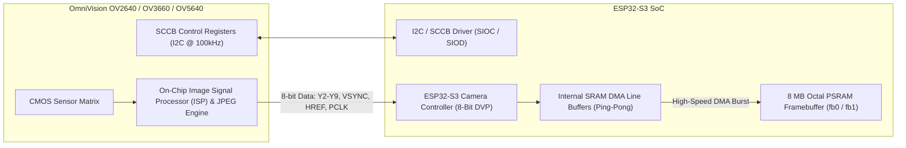

# DVP Camera Driver and PSRAM Streaming

Tamimystic OS provides a high-throughput, DMA-driven camera capture subsystem (`os_camera`) supporting OmniVision DVP (Digital Video Port) image sensors (OV2640, OV3660, and OV5640) on the ESP32-S3.

---

## Hardware Interface & DVP Parallel Bus Architecture

The camera sensor communicates with the ESP32-S3 using an 8-bit parallel Digital Video Port (DVP) combined with an SCCB (I2C-compatible) serial control bus:



### Standard Pinout Configuration:
- **`D0` to `D7`**: Data lines Y2 through Y9 (GPIO 11, 9, 8, 10, 12, 18, 17, 16)
- **`XCLK`**: Master Clock output generated by ESP32-S3 LEDC/PWM (20 MHz, GPIO 15)
- **`PCLK`**: Pixel Clock input from sensor (GPIO 13)
- **`VSYNC`**: Vertical Frame Sync input (GPIO 6)
- **`HREF`**: Horizontal Line Reference input (GPIO 7)
- **`SIOD / SIOC`**: SCCB I2C Configuration Bus (GPIO 4, GPIO 5)

---

## Zero-Copy DMA Double-Buffering Pipeline

To achieve 30+ FPS video streaming without dropping frames or stalling Core 1 real-time motion tasks, Tamimystic OS implements a double-buffered DMA pipeline:

1. **Ping-Pong Line Buffers**: Two $4\text{ KB}$ DMA buffers allocated in fast internal SRAM receive alternating scanlines directly from the DVP bus via hardware interrupts.
2. **PSRAM Frame Transfer**: Completed image frames are transferred via DMA burst into double-buffered frame buffers (`fb0` and `fb1`) located in the 8 MB Octal PSRAM.
3. **Lockless Reader Handshake**: The neural network inference engine and HTTP MJPEG streamer acquire read locks on the newest completed framebuffer without blocking camera capture.

---

## Supported Resolutions and Pixel Formats

| Pixel Format | Byte Depth | Primary Purpose | Memory Footprint (QVGA $320\times 240$) |
|---|---|---|---|
| `PIXFORMAT_JPEG` | Variable (Compressed) | High-speed Wi-Fi MJPEG video streaming | $\approx 8\text{ KB} - 35\text{ KB}$ per frame |
| `PIXFORMAT_RGB565` | 2 bytes/pixel (16-bit) | LCD display rendering and color blob tracking | $153.6\text{ KB}$ uncompressed |
| `PIXFORMAT_GRAYSCALE`| 1 byte/pixel (8-bit) | Classical computer vision (Edge detection, AprilTags) | $76.8\text{ KB}$ uncompressed |
| `PIXFORMAT_YUV422` | 2 bytes/pixel | Direct input into neural network tensor preprocessing | $153.6\text{ KB}$ uncompressed |

### Resolution Presets:
- **`QQVGA` ($160 \times 120$)**: Default input resolution for MobileNet INT8 Neural Network (55+ FPS).
- **`QVGA` ($320 \times 240$)**: Standard Web Dashboard telemetry preview (30 FPS).
- **`VGA` ($640 \times 480$)**: High-detail computer vision and remote teleoperation (15 FPS).
- **`HD` ($1280 \times 720$) / `UXGA` ($1600 \times 1200$)**: High-resolution snapshot photography.

---

## High-Performance MJPEG HTTP Streamer Engine

The embedded HTTP server streams live MJPEG video by generating continuous multipart HTTP responses:

```http
HTTP/1.1 200 OK
Content-Type: multipart/x-mixed-replace; boundary=123456789000000000000987654321
Access-Control-Allow-Origin: *

--123456789000000000000987654321
Content-Type: image/jpeg
Content-Length: 14250

<Binary JPEG Frame Data>
--123456789000000000000987654321
Content-Type: image/jpeg
Content-Length: 14310

<Binary JPEG Frame Data>
```

---

## MicroPython Camera Programming API

```python
import tamimystic
import time

# Initialize camera sensor (Resolution: 'QQVGA', 'QVGA', 'VGA'; Format: 'JPEG', 'RGB565')
tamimystic.camera.init(resolution="QVGA", pixformat="JPEG")

# Adjust sensor ISP parameters
tamimystic.camera.set_brightness(1)      # -2 to +2
tamimystic.camera.set_contrast(1)        # -2 to +2
tamimystic.camera.set_vflip(True)         # Vertical flip
tamimystic.camera.set_hmirror(False)      # Horizontal mirror

# Capture a single frame to bytes
frame_bytes = tamimystic.camera.capture()
print(f"Captured JPEG frame: {len(frame_bytes)} bytes")

# Save snapshot to LittleFS Flash VFS
with open("/storage/snapshot.jpg", "wb") as f:
    f.write(frame_bytes)
print("Snapshot saved to /storage/snapshot.jpg")
```

---

## Serial CLI and REST API Reference

### Serial CLI:
```bash
# Capture and display frame statistics
tamimystic> camera capture

# Adjust camera brightness (-2 to 2)
tamimystic> camera brightness 1

# Toggle vertical flip (0 or 1)
tamimystic> camera vflip 1

# Query camera status
tamimystic> camera status
```

### HTTP REST API:
```bash
# Continuous MJPEG Stream (Embed directly in  tag)
GET /api/camera/stream

# Single JPEG Snapshot
GET /api/camera/snapshot

# Set Camera Parameters
POST /api/camera/config?brightness=1&contrast=1&vflip=1
```
