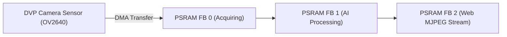

# 📷 DVP Camera Driver & Octal PSRAM Streaming Pipeline

Tamimystic OS provides a high-throughput, low-latency Digital Video Port (DVP) camera pipeline specifically engineered for the ESP32-S3's **8MB Octal PSRAM** interface.

---

## 🔬 Camera Architecture & Memory Management

Standard microcontroller camera drivers suffer from frame drops and memory starvation because internal SRAM (512KB) is too small to hold high-resolution JPEG frames.

### Triple-Buffering in 8MB Octal PSRAM
Tamimystic OS allocates framebuffers exclusively within the 8MB external Octal-SPI PSRAM using `CAMERA_FB_IN_PSRAM`:



* **DMA Hardware Transfer**: The camera sensor streams pixel data directly into PSRAM via Direct Memory Access (DMA) without loading the CPU cores.
* **Tear-Free Acquisition**: `CAMERA_GRAB_LATEST` ensures that the AI model and Web server always process the most recent visual frame without latency lag.

---

## 📷 Supported Sensors & Pinout

| Camera Sensor | Maximum Resolution | Output Formats | Recommended Resolution |
|---|---|---|---|
| **OV2640** | UXGA ($1600 \times 1200$) | JPEG, RGB565, YUV422, Grayscale | **QVGA ($320 \times 240$) / VGA ($640 \times 480$)** |
| **OV3660** | QXGA ($2048 \times 1536$) | JPEG, RGB565, YUV422 | **QVGA ($320 \times 240$) / VGA ($640 \times 480$)** |
| **OV5640** | QSXGA ($2592 \times 1944$) | JPEG, RGB565, YUV422 | **VGA ($640 \times 480$)** |

### Default DVP Camera Pin Mapping on ESP32-S3:
* **Data Bus ($D_0 - D_7$)**: GPIO 11, 9, 8, 10, 12, 18, 17, 16
* **XCLK (Master Clock)**: GPIO 15 (20 MHz)
* **PCLK (Pixel Clock)**: GPIO 13
* **VSYNC / HREF**: GPIO 6, GPIO 7
* **SCCB Control (SDA / SCL)**: GPIO 4, GPIO 5

---

## 🌐 Streaming Camera to Web Dashboard

The OS exposes a dedicated MJPEG snapshot endpoint at:
```text
GET http://<device-ip>/api/camera/snapshot
```
The in-browser Web Dashboard queries this endpoint continuously to render a 25+ FPS live camera view directly on your phone or PC.

---

## 💻 CLI Commands

```bash
# Check camera hardware status and PSRAM buffer allocation
aeron> camera status

# Capture a test snapshot frame
aeron> camera snap
```
