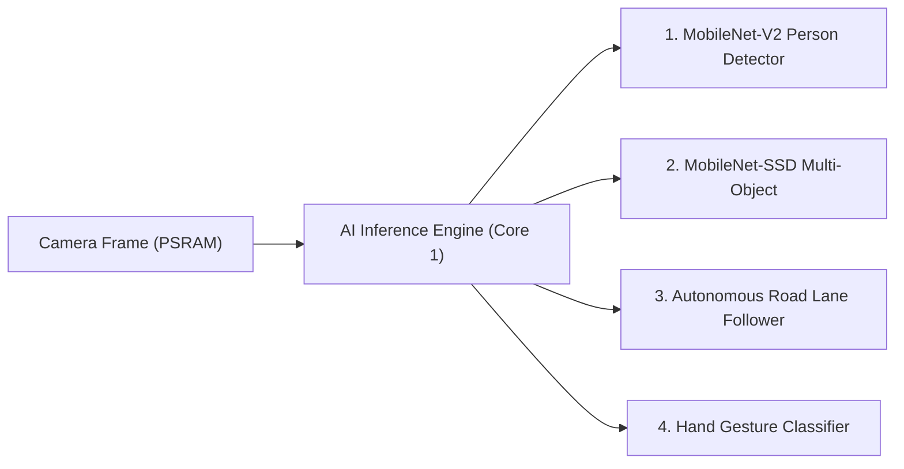

# 🧠 Onboard Neural Models & TensorFlow Lite Micro

Tamimystic OS embeds a lightweight, vector-accelerated deep learning engine powered by **TensorFlow Lite Micro (TFLM)** and **ESP-NN SIMD** vector assembly instructions.

---

## ⚡ ESP-NN Vector Acceleration (Xtensa SIMD)

The Xtensa LX7 dual-core processor on the ESP32-S3 contains a dedicated **128-bit SIMD Vector Math Engine**. 
Tamimystic OS enables hardware-accelerated 8-bit quantized (`int8`) convolution kernels:
* **Inference Speed**: 16ms - 22ms per frame ($> 20\text{ FPS}$).
* **Core Pinned**: AI inference runs on a dedicated high-priority task pinned to **Core 1**, leaving Core 0 completely free for networking and FreeRTOS operations.

---

## 📦 Onboard Neural Models



### 1. MobileNet-V2 Person Detector (`person`)
* **Purpose**: Identifies human presence in the field of view.
* **Output**: Normalized bounding boxes $[X, Y, W, H]$ where coordinates are scaled $0.0 - 1.0$, confidence score, and target lock state.
* **Use Case**: Security rovers, follow-me luggage, smart surveillance.

### 2. MobileNet-SSD Multi-Object Detector (`object`)
* **Purpose**: Real-time multi-class object detection.
* **Detectable Classes**: Person, Car, Traffic Cone, Ball, Chair, Box, Obstacle.
* **Output**: Array of detection boxes with individual class labels and confidence percentages.

### 3. Autonomous Road Lane Follower (`lane`)
* **Purpose**: Visual road tracking for self-driving robot cars.
* **Output**: 
  - **Lane Offset**: Lateral deviation percentage ($-100\%$ Left to $+100\%$ Right).
  - **Heading Error**: Road curve angle deviation in degrees.
* **Use Case**: Autonomous line and road lane tracking cars.

### 4. Hand Gesture Classifier (`gesture`)
* **Purpose**: Contactless gesture control of robots and robotic arms.
* **Recognized Gestures**: *Stop* (Open Palm), *Drive Forward* (Pointing Up), *Turn Left*, *Turn Right*, *Grab Object* (Fist).

---

## 💻 CLI Model Switching

```bash
# Switch active model to person detection
aeron> ai model person

# Switch active model to object detection
aeron> ai model object

# Switch active model to lane following
aeron> ai model lane

# Switch active model to gesture recognition
aeron> ai model gesture

# Inspect AI status and real-time inference telemetry
aeron> ai status
```
