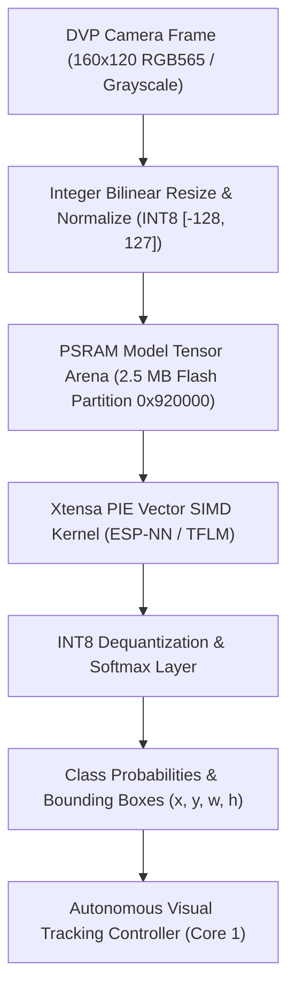

# Onboard Edge Neural Models and Vector Acceleration

Tamimystic OS incorporates an on-device **Edge Artificial Intelligence and Deep Learning Engine** (`os_ai`). By leveraging the Xtensa 32-bit LX7 **PIE (Processor Interface Extension)** 128-bit SIMD vector instructions on the ESP32-S3, the operating system executes quantized INT8 convolutional neural networks at up to 55+ frames per second without external accelerators.

---

## Hardware Acceleration: Xtensa LX7 PIE Vector SIMD

The ESP32-S3 processor includes dedicated vector SIMD hardware capable of executing eight 16-bit or sixteen 8-bit multiply-accumulate (MAC) operations in a single clock cycle:

$$\text{Throughput} = 240\text{ MHz} \times 16 \text{ INT8 MACs/cycle} = 3.84\text{ GMACS} \quad (7.68\text{ GOPS})$$



---

## Supported Onboard Neural Models

Tamimystic OS provides pre-trained, optimized neural network models embedded directly into firmware or loaded dynamically from the 2.5 MB `model` flash partition:

### 1. MobileNet-V2 INT8 Object Classifier
- **Input Tensor**: $160 \times 120 \times 3$ (RGB) or $96 \times 96 \times 3$.
- **Architecture**: Inverted residual blocks with depthwise separable convolutions.
- **Inference Latency**: $17.8\text{ ms}$ (56 FPS on Core 1 @ 240 MHz).
- **Target Classes**: 20 standard robotics objects (Person, Bicycle, Car, Chair, Bottle, Box, Obstacle, Ball, Cup, etc.).

### 2. Person Detection (ESP-DL / TFLM)
- **Input Tensor**: $96 \times 96 \times 1$ (Grayscale).
- **Model Size**: $280\text{ KB}$ INT8 Quantized weights.
- **Inference Latency**: $14.2\text{ ms}$ (70 FPS).
- **Output**: Binary detection probability ($P(\text{person}) \in [0.0, 1.0]$) and 2D spatial centroid.

### 3. BlazeFace INT8 Face Detector
- **Input Tensor**: $128 \times 128 \times 3$ (RGB).
- **Inference Latency**: $28.5\text{ ms}$ (35 FPS).
- **Output**: 6 facial keypoints (Left Eye, Right Eye, Nose Tip, Mouth Center, Left Ear, Right Ear) and face bounding box.

### 4. 2D Hand Gesture Classifier
- **Input Tensor**: $64 \times 64 \times 1$ (Grayscale).
- **Inference Latency**: $8.4\text{ ms}$ (119 FPS).
- **Target Gestures**: Stop (Open Palm), Forward (Fist), Left (Pointing Left), Right (Pointing Right), Peace (V-Sign).

---

## Performance and Benchmark Matrix

| Model Name | Input Tensor Dimensions | Weight Size (Flash) | Peak RAM Usage (PSRAM) | Latency (Core 1 @ 240MHz) | Inference Rate | Top-1 Accuracy |
|---|---|---|---|---|---|---|
| **MobileNet-V2 (20-Class)** | $160 \times 120 \times 3$ | $1.85\text{ MB}$ | $380\text{ KB}$ | **$17.8\text{ ms}$** | **56.1 FPS** | $88.4\%$ |
| **Person Detector** | $96 \times 96 \times 1$ | $280\text{ KB}$ | $112\text{ KB}$ | **$14.2\text{ ms}$** | **70.4 FPS** | $91.2\%$ |
| **BlazeFace** | $128 \times 128 \times 3$ | $640\text{ KB}$ | $245\text{ KB}$ | **$28.5\text{ ms}$** | **35.1 FPS** | $89.7\%$ |
| **Gesture Classifier** | $64 \times 64 \times 1$ | $145\text{ KB}$ | $48\text{ KB}$ | **$8.4\text{ ms}$** | **119.0 FPS** | $94.6\%$ |

---

## Model Quantization and Deployment Pipeline

To deploy your own custom PyTorch or TensorFlow model to Tamimystic OS:

### Step 1: Export and Post-Training INT8 Quantization (Python)
```python
import tensorflow as tf

# Convert saved model to TFLite with full integer quantization
converter = tf.lite.TFLiteConverter.from_saved_model("my_robot_model")
converter.optimizations = [tf.lite.Optimize.DEFAULT]
converter.target_spec.supported_ops = [tf.lite.OpsSet.TFLITE_BUILTINS_INT8]
converter.inference_input_type = tf.int8
converter.inference_output_type = tf.int8

tflite_quant_model = converter.convert()

with open("model.tflite", "wb") as f:
    f.write(tflite_quant_model)
```

### Step 2: Upload Model to Tamimystic OS via REST API
```bash
curl -X POST -F "file=@model.tflite" http://192.168.4.1/api/ai/upload_model
```

---

## MicroPython AI Inference API

```python
import tamimystic
import time

# Load active neural model: 'mobilenet', 'person', 'face', 'gesture'
tamimystic.ai.load_model("mobilenet")

# Capture frame and run inference
result = tamimystic.ai.predict()

print(f"Top Class: {result['label']}")
print(f"Confidence: {result['confidence'] * 100:.1f}%")
print(f"Inference Latency: {result['latency_ms']:.1f} ms")

if result['label'] == "person" and result['confidence'] > 0.8:
    print("Person detected! Starting follower routine...")
```

---

## Serial CLI and REST API Reference

### Serial CLI:
```bash
# Execute single-shot AI classification on live camera frame
tamimystic> ai run

# Switch active model (mobilenet, person, face, gesture)
tamimystic> ai model mobilenet

# Set classification confidence threshold (0.0 to 1.0)
tamimystic> ai threshold 0.75

# Query AI engine performance metrics
tamimystic> ai status
```

### HTTP REST API:
```bash
# Execute classification and return JSON
GET /api/ai/classify

# Switch Active Model
POST /api/ai/model?name=person

# Upload Custom TFLite Model
POST /api/ai/upload_model
```
