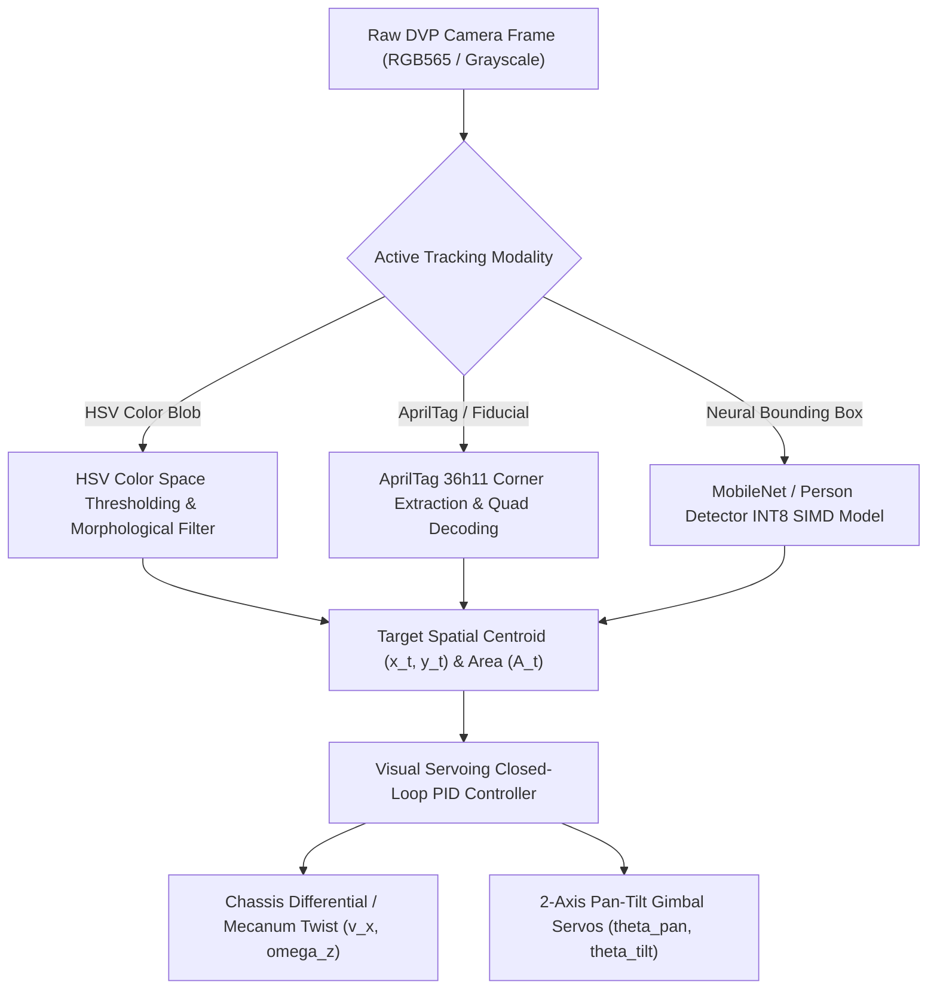
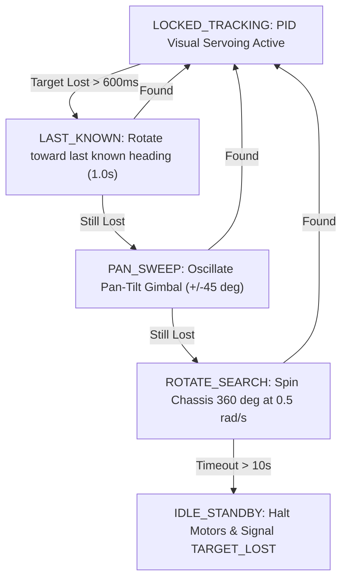

# Autonomous Visual Tracking Engine

Tamimystic OS features a real-time **Image-Based Visual Servoing (IBVS) and Visual Tracking Subsystem** (`os_tracking`) that enables mobile rovers and pan-tilt gimbal mechanisms to autonomously lock onto, center, and track targets in dynamic environments.

---

## Tracking Modalities

The visual tracking engine operates across three distinct computer vision pipelines:



### 1. HSV Color Blob Tracking
Converts RGB565 scanlines into HSV (Hue, Saturation, Value) space and applies user-configured threshold ranges $[H_{\min}, H_{\max}]$, $[S_{\min}, S_{\max}]$, $[V_{\min}, V_{\max}]$:
- **Centroid Calculation**:
  $$x_c = \frac{\sum_{i=1}^N x_i}{N}, \quad y_c = \frac{\sum_{i=1}^N y_i}{N}$$
  Where $N$ is total detected pixel count (Area $A_c = N$).

### 2. AprilTag / Fiducial Marker Tracking
Detects standard **Tag36h11** fiducial markers to extract 6-DOF relative transformation matrices $[R | t]$ between the camera optical frame and the target tag.

### 3. Neural Object Bounding Box Tracking
Utilizes bounding box coordinates $[x_{\min}, y_{\min}, x_{\max}, y_{\max}]$ produced by the onboard MobileNet INT8 engine to track people, vehicles, or custom trained objects.

---

## Visual Servoing PID Controller Derivation

Let $(x_c, y_c)$ denote the normalized target centroid in the camera viewport $[-1.0, +1.0]$, where $(0, 0)$ represents exact optical center:

$$e_x = x_c - 0.0$$

$$e_y = y_c - 0.0$$

$$e_{\text{dist}} = A_{\text{target}} - A_{\text{measured}}$$

### Chassis Steering & Drive Velocity Output:
$$\omega_z(t) = - \left( K_{p,\text{yaw}} \cdot e_x + K_{d,\text{yaw}} \cdot \frac{de_x}{dt} \right)$$

$$v_x(t) = \text{clamp}\left( K_{p,\text{dist}} \cdot e_{\text{dist}}, 0.0, v_{\max} \right)$$

### Pan-Tilt Gimbal Joint Outputs:
$$\theta_{\text{pan}}(t + \Delta t) = \theta_{\text{pan}}(t) - K_{\text{gimbal}} \cdot e_x$$

$$\theta_{\text{tilt}}(t + \Delta t) = \theta_{\text{tilt}}(t) + K_{\text{gimbal}} \cdot e_y$$

---

## Target Loss Recovery State Machine

If the target leaves the camera field-of-view ($N < \text{Area}_{\min}$ for $> 600\text{ ms}$), the system enters an automated recovery state machine:



---

## MicroPython Visual Tracking API

```python
import tamimystic
import time

# Configure Color Tracking for Orange Ball (HSV Ranges)
tamimystic.tracking.set_mode("color")
tamimystic.tracking.set_hsv_filter(h_min=10, h_max=25, s_min=150, s_max=255, v_min=100, v_max=255)

# Set PID gains
tamimystic.tracking.set_pid(kp_yaw=1.5, kd_yaw=0.1, kp_dist=0.8)

# Enable autonomous visual servoing
tamimystic.tracking.start()

print("Autonomous visual tracking engaged!")

while True:
    state = tamimystic.tracking.get_status()
    if state['locked']:
        print(f"Target Locked at ({state['cx']:.2f}, {state['cy']:.2f}) Area={state['area']} px")
    else:
        print("Searching for target...")
    time.sleep(0.1)
```

---

## Serial CLI and REST API Reference

### Serial CLI:
```bash
# Start visual tracking (mode: color, person, apriltag)
tamimystic> tracking start person

# Set HSV color filter (h_min, h_max, s_min, s_max, v_min, v_max)
tamimystic> tracking hsv 10 25 150 255 100 255

# Stop visual tracking
tamimystic> tracking stop

# Query tracking state
tamimystic> tracking status
```

### HTTP REST API:
```bash
# Start Tracking
POST /api/tracking/start?mode=person

# Stop Tracking
POST /api/tracking/stop

# Configure HSV Ranges
POST /api/tracking/hsv?h_min=10&h_max=25&s_min=150&s_max=255&v_min=100&v_max=255

# Query Tracking State JSON
GET /api/tracking/status
```
