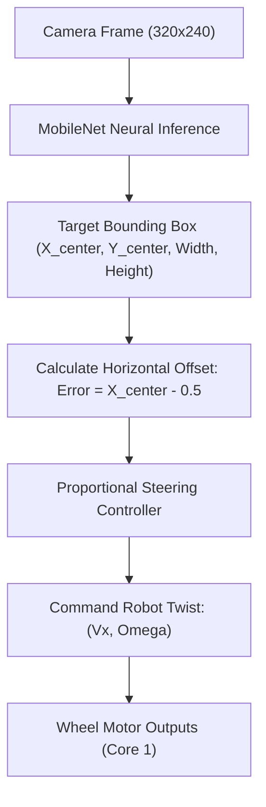

# 🎯 Autonomous Visual Target Tracking & Auto-Drive

Tamimystic OS features a closed-loop **Visual Servoing & Autonomous Tracking Pipeline** that connects AI bounding box detections directly to the wheeled kinematics engine.

---

## 🔄 Visual Tracking Control Loop

When Visual Tracking is enabled (`ai track on` or Web Dashboard toggle), the OS runs a high-speed tracking loop:



---

## 🧮 Control Mathematics

Given a detected target center $x_{\text{center}} \in [0.0, 1.0]$:

### 1. Horizontal Tracking Offset ($\Delta x$)
$$\Delta x = x_{\text{center}} - 0.5$$
* If $\Delta x < 0$: Target is to the **left** of the camera center $\implies$ Robot must turn left.
* If $\Delta x > 0$: Target is to the **right** of the camera center $\implies$ Robot must turn right.

### 2. Angular Steering Velocity ($\omega$)
$$\omega = -K_p \cdot \Delta x \cdot 100.0\%$$
*(Default $K_p = 1.2$ for fast, responsive centering).*

### 3. Forward Follow Speed ($v_x$)
To maintain a safe following distance based on the target bounding box width $w$:
$$v_x = \begin{cases} 40.0\% & \text{if target locked and } w < 0.35 \text{ (Target is far away)} \\ 0.0\% & \text{if } w \ge 0.35 \text{ (Target reached comfortable distance)} \end{cases}$$

---

## 💻 CLI & API Usage

```bash
# Enable Autonomous Visual Tracking
aeron> ai track on

# Disable Tracking and return to manual control
aeron> ai track off
```

### Via HTTP REST API:
```bash
# Enable visual tracking
curl -X POST "http://<device-ip>/api/ai/track?enable=1"

# Disable visual tracking
curl -X POST "http://<device-ip>/api/ai/track?enable=0"
```
