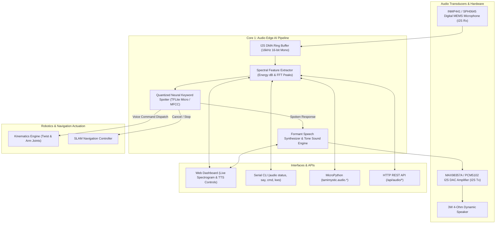

# Audio Edge AI, Keyword Spotting and Voice Synthesis

Tamimystic OS incorporates a low-latency, on-device Audio Edge AI subsystem designed for embedded voice control, real-time keyword spotting (KWS), and algorithmic voice speech synthesis. Operating directly on the ESP32-S3 Dual-Core Xtensa processor and native PC simulation, the audio subsystem processes 16kHz 16-bit PCM audio streams on Core 1 without needing external cloud APIs.

---

## System Architecture



---

## Supported Hardware and Default Pinout

Tamimystic OS interfaces with standard I2S digital audio hardware:

| Peripheral | Chip Model | Interface | ESP32-S3 GPIO | Function Description |
|---|---|---|---|---|
| **I2S Bit Clock** | All I2S Transceivers | Clock | **GPIO 41** | Synchronizes bit data transfer. |
| **I2S Word Select (WS/LRCK)** | All I2S Transceivers | Clock | **GPIO 42** | Left/Right channel framing (16 kHz). |
| **Digital Microphone** | INMP441 / SPH0645 | Serial Data In (DIN) | **GPIO 40** | Digital MEMS audio capture. |
| **I2S DAC Amplifier** | MAX98357A / PCM5102 | Serial Data Out (DOUT) | **GPIO 39** | 3.2W Class-D mono audio output. |

> All I2S pin allocations can be dynamically reassigned via the Dynamic Pin Matrix without recompiling the firmware.

---

## Keyword Spotting (KWS) Vocabulary

The on-device keyword classifier listens for pre-trained voice commands and executes immediate robotic actions:

| Voice Command | Trigger Phrases | Executed Action | Spoken Confirmation |
|---|---|---|---|
| **Wake-Up** | *"Hey Tamimystic"*, *"Wake Up"* | Activates high-attention mode | "Yes, I am listening." |
| **Drive Forward** | *"Drive Forward"*, *"Forward"* | Commands rover linear speed $+40\%$ | "Driving forward." |
| **Reverse** | *"Drive Backward"*, *"Reverse"* | Commands rover linear speed $-40\%$ | "Reversing rover." |
| **Turn Left** | *"Turn Left"* | Commands angular speed $+35\%$ | "Turning left." |
| **Turn Right** | *"Turn Right"* | Commands angular speed $-35\%$ | "Turning right." |
| **Emergency Stop** | *"Stop"*, *"Halt"*, *"Brake"* | Immediate robot brake and navigation abort | "Emergency stop activated." |
| **Arm Home** | *"Arm Home"*, *"Reset Arm"* | Sets 6-DOF robotic arm to home pose | "Resetting robotic arm to home pose." |
| **Grab Object** | *"Grab Object"*, *"Pick Up"* | Executes gripper grasp sequence | "Closing robotic gripper to grab object." |
| **Status Report** | *"Status Report"*, *"Report"* | Audits battery and navigation state | "All systems nominal. Ready for navigation." |

---

## Formant Speech Synthesis & Sound Generation

Tamimystic OS incorporates a lightweight formant speech synthesizer and algorithmic tone generator:

1. **Carrier Envelope Shaping**: Uses attack/decay envelopes on sine waves and harmonic carriers to prevent acoustic clicks.
2. **Pre-Programmed Chimes**:
   - **Pattern 1 (Boot Chime)**: C5 (523 Hz) $\rightarrow$ E5 (659 Hz) $\rightarrow$ G5 (784 Hz) ascending major triad.
   - **Pattern 2 (Obstacle Warning)**: Dual 880 Hz pulses.
   - **Pattern 3 (Command Acknowledged)**: High 1046 Hz chirp.
   - **Pattern 4 (Emergency Alarm)**: Low 220 Hz warning buzzer.

---

## Web Dashboard Audio Control

The Web Dashboard features a real-time Audio Control Card:

1. Open `http://<device-ip>/` in your browser.
2. Locate the **Audio Edge AI & Voice Synthesis** card:
   - **Live Spectrogram Canvas**: Visualizes real-time microphone decibel levels and audio waveform.
   - **Voice Keyword Simulator**: Test keywords with single-click triggers.
   - **Text-to-Speech (TTS) Engine**: Enter arbitrary text phrases to synthesize voice responses on the connected speaker.
   - **Volume Slider**: Adjust master playback volume dynamically.

---

## Python API Reference

Control audio synthesis and keyword spotting in MicroPython scripts:

```python
import tamimystic

# Speak a custom sentence
tamimystic.audio.say("Obstacle detected. Planning alternate route.")

# Play an alert tone (frequency in Hz, duration in ms)
tamimystic.audio.tone(880, 200)

# Play pre-programmed sound pattern (1 to 4)
tamimystic.audio.beep(3)

# Set master speaker volume (0 to 100%)
tamimystic.audio.volume(85)
```

---

## Serial CLI Commands

Manage the audio subsystem directly from the serial shell:

```bash
# View audio subsystem status, energy level, volume, and last command
aeron> audio status

# Synthesize and speak a phrase
aeron> audio say Robot initialized and ready for deployment

# Play a test tone (880 Hz for 250 ms)
aeron> audio tone 880 250

# Play a sound pattern (1=Boot, 2=Warning, 3=Chirp, 4=Alarm)
aeron> audio beep 1

# Trigger a voice command manually
aeron> audio cmd forward

# Adjust master volume (0-100)
aeron> audio vol 90

# Toggle keyword spotting on or off
aeron> audio kws on
```

---

## REST API Endpoints

| Endpoint | Method | Parameters | Response Description |
|---|---|---|---|
| `/api/audio/status` | `GET` | None | JSON object with KWS state, last command, volume, and energy dB. |
| `/api/audio/waveform` | `GET` | None | Array of 32 live waveform magnitude values for web visualizers. |
| `/api/audio/say` | `POST` / `GET` | `text=<string>` | Synthesizes and speaks the given text string. |
| `/api/audio/tone` | `POST` / `GET` | `freq=<int>&dur=<int>` | Plays a pure sine tone at specified frequency and duration. |
| `/api/audio/beep` | `POST` / `GET` | `pattern=<1-4>` | Plays pre-programmed sound patterns. |
| `/api/audio/kws` | `POST` / `GET` | `enable=<0\|1>` | Enables or disables the on-device keyword spotter. |
| `/api/audio/cmd` | `POST` / `GET` | `cmd=<string>` | Injects and executes a named voice command. |
| `/api/audio/volume` | `POST` / `GET` | `vol=<0-100>` | Sets master speaker volume. |
