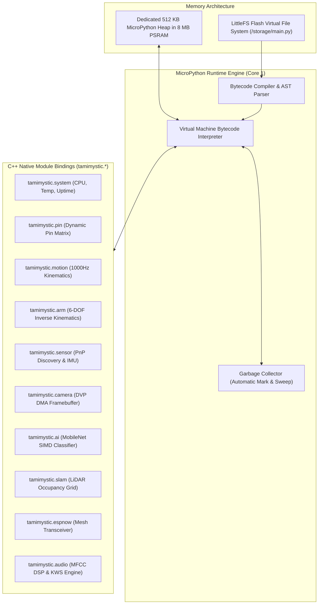

# MicroPython Runtime and Standard Library

Tamimystic OS embeds a custom **MicroPython Embedded Runtime Engine** (`os_apps`) that provides a high-level, sandboxed Python programming environment directly on the ESP32-S3. Through the native `tamimystic` C-extension module, developers can orchestrate complex multi-subsystem robotics behaviors using Python without recompiling firmware.

---

## Runtime Architecture and Memory Sandboxing

The MicroPython Virtual Machine runs as an isolated FreeRTOS task pinned to **Core 1**:



---

## Complete `tamimystic` Standard Library Reference

### 1. `tamimystic.system` Module
Provides access to core hardware metrics and power state:

| Function | Return Type | Description |
|---|---|---|
| `tamimystic.system.get_uptime()` | `int` | System uptime in seconds since boot. |
| `tamimystic.system.get_free_heap()` | `int` | Free internal SRAM memory in bytes. |
| `tamimystic.system.get_free_psram()` | `int` | Free 8 MB Octal PSRAM memory in bytes. |
| `tamimystic.system.get_cpu_temp()` | `float` | On-chip silicon temperature in degrees Celsius. |
| `tamimystic.system.reboot()` | `None` | Triggers a clean software reboot of the SoC. |

---

### 2. `tamimystic.pin` Module
Controls the Dynamic Software Pin Matrix:

| Function | Parameters | Description |
|---|---|---|
| `tamimystic.pin.get(func_name)` | `str` | Returns the assigned GPIO number for an abstract function. |
| `tamimystic.pin.set(func_name, gpio)` | `str, int` | Re-assigns an abstract function to a new GPIO and saves to NVS. |
| `tamimystic.pin.is_safe(gpio)` | `int` | Returns `True` if GPIO is safe for user configuration. |
| `tamimystic.pin.read(gpio)` | `int` | Reads digital input state (`0` or `1`). |
| `tamimystic.pin.write(gpio, val)` | `int, int` | Writes digital output level (`0` or `1`). |
| `tamimystic.pin.reset_defaults()` | `None` | Restores all pin mappings to factory defaults. |

---

### 3. `tamimystic.motion` Module
Interfaces directly with the 1000 Hz motion control engine:

| Function | Parameters | Description |
|---|---|---|
| `tamimystic.motion.set_type(type_str)` | `'diff'|'mecanum'|'ackermann'` | Configures the active chassis kinematics model. |
| `tamimystic.motion.drive(linear, angular)` | `float, float` | Commands forward linear speed ($m/s$) and angular yaw ($rad/s$). |
| `tamimystic.motion.drive_holonomic(vx, vy, omega)` | `float, float, float` | Commands 3-DOF holonomic translation for Mecanum chassis. |
| `tamimystic.motion.stop()` | `None` | Instantly stops all drive motors. |
| `tamimystic.motion.get_pose()` | `None` | Returns dictionary `{'x': float, 'y': float, 'theta': float}`. |
| `tamimystic.motion.reset_odometry()` | `None` | Resets global Cartesian pose coordinates to $(0, 0, 0)$. |
| `tamimystic.motion.set_pid(kp, ki, kd)` | `float, float, float` | Updates closed-loop velocity PID controller gains. |

---

### 4. `tamimystic.arm` Module
Controls 6-DOF robotic manipulator inverse kinematics:

| Function | Parameters | Description |
|---|---|---|
| `tamimystic.arm.move_to(x, y, z, pitch, roll, duration)` | `float, float, float, float, float, float` | Computes IK and moves end-effector to target coordinate ($mm$). |
| `tamimystic.arm.set_joints(joint_list)` | `list[float]` | Directly sets joint angles ($\theta_1 \dots \theta_6$) in degrees. |
| `tamimystic.arm.set_gripper(percent)` | `int (0-100)` | Opens/closes end-effector gripper claw. |
| `tamimystic.arm.get_pose()` | `None` | Returns FK computed Cartesian position and orientation. |

---

### 5. `tamimystic.sensor` Module
Queries plug-and-play I2C sensors and drives OLED displays:

| Function | Return Type | Description |
|---|---|---|
| `tamimystic.sensor.scan()` | `list[str]` | Scans I2C bus and returns list of discovered sensor names. |
| `tamimystic.sensor.get_imu()` | `dict` | Returns `{'roll': float, 'pitch': float, 'yaw': float, 'accel_z': float}`. |
| `tamimystic.sensor.get_distance_mm()` | `int` | Returns Time-of-Flight laser distance measurement in millimeters. |
| `tamimystic.sensor.get_environment()` | `dict` | Returns `{'temp_c': float, 'humidity_pct': float, 'pressure_hpa': float}`. |
| `tamimystic.sensor.oled_print(x, y, text)` | `int, int, str` | Draws text onto SSD1306 OLED frame buffer. |
| `tamimystic.sensor.oled_flush()` | `None` | Transfers OLED frame buffer to physical display. |

---

### 6. `tamimystic.ai` & `tamimystic.camera` Modules
Controls DVP camera capture and INT8 neural network inference:

| Function | Parameters | Description |
|---|---|---|
| `tamimystic.camera.init(res, fmt)` | `str, str` | Initializes DVP camera (`'QVGA'`, `'JPEG'`). |
| `tamimystic.camera.capture()` | `None` | Returns raw binary frame bytes. |
| `tamimystic.ai.load_model(name)` | `'mobilenet'|'person'` | Loads active quantized deep learning model. |
| `tamimystic.ai.predict()` | `None` | Runs inference and returns `{'label': str, 'confidence': float, 'latency_ms': float}`. |

---

### 7. `tamimystic.espnow` Module
Manages low-latency 2.4 GHz mesh swarm communication:

| Function | Parameters | Description |
|---|---|---|
| `tamimystic.espnow.status()` | `None` | Returns radio state, channel, and packet statistics. |
| `tamimystic.espnow.get_peers()` | `None` | Returns list of discovered swarm node MAC addresses. |
| `tamimystic.espnow.broadcast(payload_str)` | `str` | Broadcasts string payload to all nearby nodes. |
| `tamimystic.espnow.send_swarm_cmd(linear, angular)` | `float, float` | Transmits synchronized swarm formation velocity vector. |

---

## Complete Autonomous Mission Script Example

Save this script as `/storage/main.py` using the Web IDE:

```python
import tamimystic
import time

print("Starting Tamimystic Autonomous Patrol Mission...")

# Configure chassis
tamimystic.motion.set_type("diff")
tamimystic.ai.load_model("mobilenet")

# Mission Loop
while True:
    # 1. Read Distance Sensor
    dist = tamimystic.sensor.get_distance_mm()
    
    if dist < 250:
        # Obstacle detected -> Stop and run AI inspection
        tamimystic.motion.stop()
        print("Obstacle encountered! Inspecting with camera...")
        
        result = tamimystic.ai.predict()
        print(f"Detected Object: {result['label']} (Confidence: {result['confidence']:.2f})")
        
        # Broadcast discovery to ESP-NOW swarm
        tamimystic.espnow.broadcast(f"OBSTACLE:{result['label']}")
        
        # Turn away
        tamimystic.motion.drive(0.0, 1.2)
        time.sleep(1.0)
    else:
        # Clear path -> Move forward
        tamimystic.motion.drive(0.35, 0.0)
        
    time.sleep(0.05)
```
