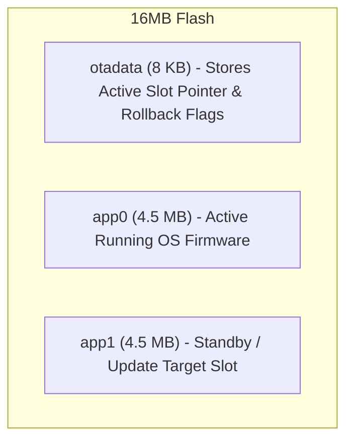

# 🔄 Dual-Bank Over-The-Air (OTA) Firmware Updates

Tamimystic OS incorporates a robust **Dual-Bank (A/B) OTA Update Engine** with automated verification and rollback protection.

---

## 🛡️ A/B Dual-Bank Partitioning Architecture

The 16MB flash layout divides firmware storage into two distinct 4.5MB application slots:



### The Update Workflow:
1. **Target Identification**: While running from `app0`, the OS routes incoming firmware writes to the standby partition `app1`.
2. **Flash & Checksum Verification**: The update file is streamed over Wi-Fi, decrypted, and written block-by-block. The SHA-256 image checksum is verified.
3. **Boot-Slot Switching**: If verified, the `otadata` register switches the boot pointer to `app1`.
4. **Self-Testing & Rollback**: Upon first boot of the new firmware, the OS runs self-diagnostics. If a crash or bootloop occurs, the hardware automatically reverts to `app0` without bricking!

---

## 🌐 In-Browser Web OTA Update

1. Open the Web Dashboard (`http://<device-ip>/`).
2. Scroll to the **🔄 Dual-Bank OTA Firmware Update** card.
3. Choose your compiled `tamimystic_os.bin` file.
4. Click **Upload & Flash OTA**.
5. The device will upload, flash, verify, and reboot within 15 seconds.

---

## 💻 CLI OTA Commands

```bash
# Check current active OTA boot slot and rollback armed status
aeron> ota status
```

### CLI Output:
```text
aeron> ota status

=== Dual-Bank OTA Subsystem Status ===
  Running Firmware Partition: app0 (Slot 0)
  Next OTA Target Partition:  app1 (Slot 1)
  Flash Partition Size:       4.5 MB per bank
  OTA Boot State:             VALIDATED (Rollback Armed)
=====================================
```
