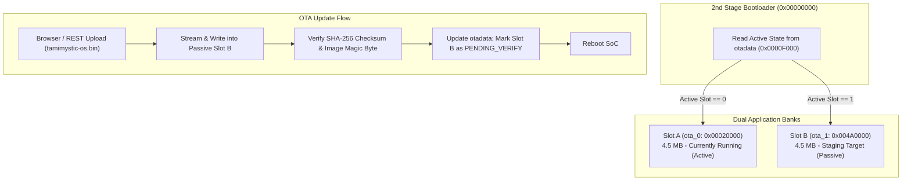
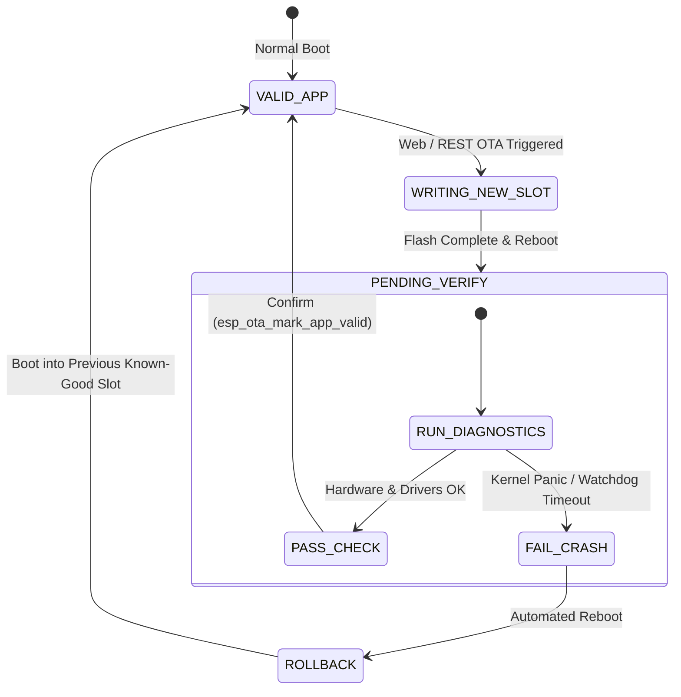

# Dual-Bank Over-The-Air (OTA) Firmware Updates

Tamimystic OS incorporates an enterprise-grade, fail-safe **Dual-Bank A/B Over-The-Air (OTA) Firmware Engine** (`os_ota`). This system enables wireless updates over Wi-Fi without taking the robot offline, backed by automated rollback protection to prevent bricking if an update contains a critical error.

---

## Dual-Bank A/B Partition Architecture

The 16 MB flash memory is partitioned into two symmetrical 4.5 MB executable application slots (`ota_0` and `ota_1`) governed by the 8 KB `otadata` state partition:



---

## Automatic Rollback State Machine

To protect robots operating in remote or inaccessible physical environments, the bootloader enforces a strict verification lifecycle:



### Self-Diagnostics Verification Sequence:
1. On first boot of a new firmware version, `otadata` marks the application as `ESP_OTA_IMG_PENDING_VERIFY`.
2. The kernel executes self-tests: initializes Octal PSRAM, starts 1000 Hz motion loop, validates sensor bus, and connects to Wi-Fi.
3. If all tests pass within 10 seconds, the kernel invokes `esp_ota_mark_app_valid_cancel_rollback()`, cementing the update.
4. If a kernel panic, memory corruption, or hardware watchdog reset occurs before validation, the bootloader immediately marks the slot as `ESP_OTA_IMG_INVALID` and boots back into the previous working slot.

---

## Method 1: Web Dashboard Drag-and-Drop OTA Portal

1. Open your browser to `http://<device-ip>/` (or navigate directly to `http://<device-ip>/update`).
2. Locate the **Firmware OTA Update** card.
3. Drag and drop your compiled `tamimystic-os.bin` binary file.
4. The dashboard displays a real-time progress bar with write speed and verified block CRC.
5. Upon completion, the board reboots automatically and completes self-verification.

---

## Method 2: HTTP REST API Binary Streaming (`curl`)

Deploy firmware updates directly from a terminal or CI/CD deployment script:

```bash
# Upload and flash firmware binary to passive slot
curl -X POST \
  -H "Content-Type: application/octet-stream" \
  --data-binary "@build/tamimystic-os.bin" \
  http://192.168.1.150/api/ota/upload

# Check OTA partition status
curl http://192.168.1.150/api/ota/status
```

**Expected JSON Response:**
```json
{
  "running_partition": "ota_0",
  "boot_partition": "ota_0",
  "next_update_partition": "ota_1",
  "firmware_version": "v1.0.0",
  "compile_time": "Sep 12 2026 14:20:10",
  "chip_model": "ESP32-S3 (revision v0.2)",
  "flash_size_bytes": 16777216,
  "status": "IDLE"
}
```

---

## Method 3: Serial CLI OTA Management

```bash
# Query active OTA slots and version information
tamimystic> ota status

# Force manual rollback to the previous firmware partition
tamimystic> ota rollback
[OTA] Rolling back boot target to previous slot...
[OTA] Rebooting into fallback firmware now.
```
