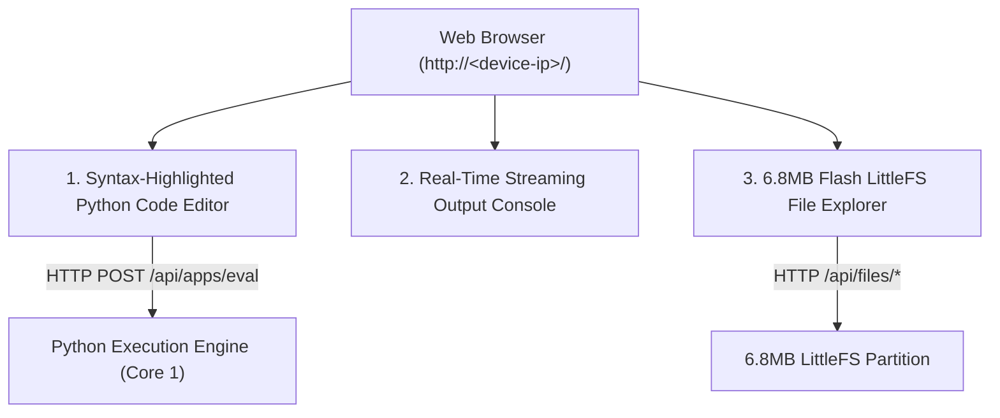

# 🌐 In-Browser Web Python IDE & 6.8MB Flash VFS

Tamimystic OS hosts a complete, interactive **Web Python IDE** directly on its embedded web server, turning any browser into a full-featured robotics programming environment.

---

## 🎨 Web IDE Features



1. **Code Editor**: Clean, responsive editor with Python syntax highlighting and keyboard shortcuts.
2. **Instant Hardware Execution**: Press `Run Script` to execute code immediately on the ESP32-S3.
3. **Live Output Console**: Captures all `print(...)` outputs and runtime logs from the hardware in real-time.
4. **Flash File Management**:
   - Inspect total and free flash memory on the 6.8MB LittleFS partition.
   - Save scripts directly to flash.
   - Delete obsolete files with one click.
   - Create an `autorun.py` script that boots automatically on power-on.

---

## 📁 6.8MB LittleFS Flash Virtual File System (VFS)

The storage partition is mounted under `/storage` using a high-reliability LittleFS filesystem:
* **Wear Leveling**: Distributes write cycles across physical flash blocks to extend chip lifespan.
* **Power-Loss Resilient**: Journaled writes prevent file corruption if battery power is abruptly disconnected during robotic operation.

---

## 💻 CLI Storage Commands

```bash
# List all files and sizes in flash VFS
aeron> storage ls

# View flash disk space usage (Total, Used, Free)
aeron> storage df

# Delete a file from flash
aeron> storage rm "test.py"
```

### Example CLI Output:
```text
aeron> storage ls

=== LittleFS Flash Filesystem (6.8MB Partition) ===
  Filename                       | Size (Bytes)
  -------------------------------+--------------
  autorun.py                     | 412
  neural_weights.bin             | 218400
  robot_config.json              | 128
=================================================

aeron> storage df
Storage: Total: 6800 KB, Used: 214 KB, Free: 6586 KB
```
