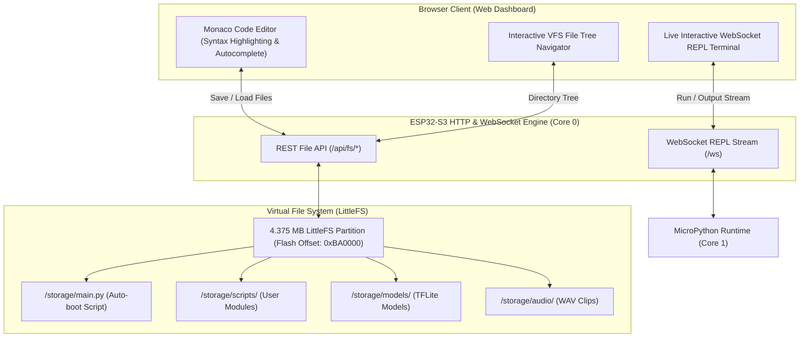

# In-Browser Web IDE and Virtual File System

Tamimystic OS includes a zero-installation, **In-Browser Web IDE** integrated directly into the web dashboard. Developers can write, edit, syntax-highlight, execute, and debug MicroPython scripts directly inside Google Chrome or Microsoft Edge, persisting code on the onboard LittleFS Virtual File System (VFS).

---

## Architectural Workflow

The Web IDE connects to the ESP32-S3 via asynchronous REST endpoints for file manipulation and a bi-directional WebSocket stream for live REPL console execution:



---

## LittleFS Virtual File System Architecture

Tamimystic OS allocates a dedicated **4.375 MB LittleFS partition** (`storage` partition at offset `0xBA0000`):

- **Power-Fail Resilient**: Atomic transactions guarantee filesystem consistency even during sudden battery disconnection.
- **Dynamic Wear-Leveling**: Distributes write/erase cycles evenly across flash sectors to maximize silicon lifespan.
- **Low RAM Overhead**: Bounded RAM buffers prevent out-of-memory heap fragmentation.

### Recommended Directory Hierarchy:
```text
/storage/
├── main.py             # Primary application script executed automatically at boot
├── config.json         # User hardware and controller configuration overrides
├── scripts/            # Secondary user-defined Python library modules
│   ├── pid_tuner.py
│   └── maze_solver.py
├── models/             # Custom INT8 Quantized Deep Learning TFLite models
│   └── custom_yolo.tflite
└── audio/              # Pre-recorded 16kHz WAV alert clips
    ├── boot.wav
    └── alert.wav
```

---

## Automatic Boot Execution (`/storage/main.py`)

During startup, once Core 0 and Core 1 kernel drivers are initialized:
1. The OS checks for the existence of `/storage/main.py`.
2. If found, a background FreeRTOS execution task launches on Core 1 to execute the script.
3. If an unhandled exception occurs in `main.py`, the error trace is captured, logged to `/storage/error.log`, and displayed in the Web IDE console without crashing the underlying OS kernel.

---

## REST File Management Endpoints

The operating system exposes a full set of POSIX-like file management HTTP endpoints:

### 1. List Directory Contents
```bash
GET /api/fs/list?path=/storage
```
**Response JSON:**
```json
{
  "path": "/storage",
  "total_bytes": 4587520,
  "free_bytes": 4128768,
  "files": [
    {"name": "main.py", "size": 1420, "is_dir": false},
    {"name": "config.json", "size": 380, "is_dir": false},
    {"name": "scripts", "size": 0, "is_dir": true}
  ]
}
```

### 2. Read File Contents
```bash
GET /api/fs/read?file=/storage/main.py
```
**Response:** Plain text content of the target script.

### 3. Write / Save File Contents
```bash
POST /api/fs/write?file=/storage/main.py
Content-Type: text/plain

import tamimystic
print("Updated main script active!")
```

### 4. Delete File
```bash
POST /api/fs/delete?file=/storage/test.py
```

### 5. Format Virtual File System
```bash
POST /api/fs/format
```

---

## Live WebSocket REPL and Script Execution

The Web IDE maintains a persistent WebSocket connection to `/ws` for bi-directional script execution:

| Command JSON Payload | Direction | Action |
|---|---|---|
| `{"action": "run", "code": "<python_code>"}` | Client $\to$ ESP32 | Compiles and executes code block immediately on Core 1. |
| `{"action": "stop"}` | Client $\to$ ESP32 | Sends asynchronous interrupt signal (`KeyboardInterrupt`) to halt running script. |
| `{"type": "stdout", "data": "<text>"}` | ESP32 $\to$ Client | Live standard output stream printed to browser console. |
| `{"type": "stderr", "data": "<traceback>"}` | ESP32 $\to$ Client | Exception traceback highlighting exact error line. |
