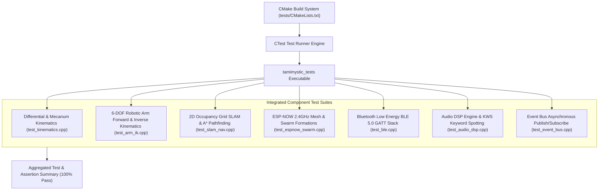

# Automated Testing and Subsystem Benchmarks

Tamimystic OS includes an automated **CTest Unit Test Suite** and a micro-benchmarking engine designed to validate algorithm correctness, verify mathematical kinematics models, prevent regressions, and measure execution throughput across the native PC simulator and embedded ESP32-S3 targets.

---

## Test Suite Architecture

The test framework is designed to run natively on host systems (Linux x86_64, macOS, and Windows MinGW) as well as within automated CI/CD runners before firmware deployment.



---

## Component Test Suites Overview

### 1. Kinematics and Motion Engine (`test_kinematics.cpp`)
- **Differential Drive**: Tests forward velocity, pure spin in place, reverse motion, and motor saturation normalization (clamping wheel output within $[-100.0, +100.0]\%$).
- **Mecanum 4WD Omnidirectional Drive**: Tests holonomic translation vector decomposition, lateral strafe left/right, diagonal drive, and simultaneous translation plus angular yaw velocity.

### 2. Robotic Arm 6-DOF Inverse and Forward Kinematics (`test_arm_ik.cpp`)
- **Analytical IK Solver Convergence**: Verifies closed-form inverse kinematics for reachable Cartesian coordinate targets $(X, Y, Z, \text{pitch})$.
- **Joint Limit Constraints**: Ensures computed servo angles stay strictly within the $[0^\circ, 180^\circ]$ hardware boundary.
- **Round-Trip Consistency**: Computes $\text{FK}(\text{IK}(X, Y, Z)) \equiv (X, Y, Z)$ within a spatial tolerance of $\epsilon < 0.5\text{ cm}$.
- **Workspace Singularity and Boundary Rejection**: Verifies that requests outside the mechanical envelope (such as targets exceeding the maximum link reach of $38\text{ cm}$) are safely rejected without floating-point exceptions.

### 3. 2D LiDAR SLAM and A* Navigation (`test_slam_nav.cpp`)
- **Occupancy Grid Operations**: Tests memory allocation, clearing, dynamic log-odds updates ($+100$ occupied, $-50$ free space), and bounds protection across the $200 \times 200$ grid ($10\text{m} \times 10\text{m}$ at $5\text{cm}$ resolution).
- **A* Global Path Planning**: Tests obstacle avoidance, 8-directional neighbor heuristic expansion ($h(n) = \sqrt{\Delta x^2 + \Delta y^2}$), and waypoint sequence generation connecting start to goal.

### 4. ESP-NOW Mesh and Swarm Formations (`test_espnow_swarm.cpp`)
- **Swarm Roles**: Validates `LEADER`, `FOLLOWER`, and `STANDALONE` mode switching, follower slot assignment, and inter-robot distance spacing.
- **Formation Geometry**: Verifies `LINE`, `COLUMN`, `VEE`, and `TRIANGLE` formation configurations.
- **Wireless Remote Mode**: Validates bidirectional toggling of the low-latency handheld gamepad bridge.

### 5. BLE 5.0 GATT and Mobile Telemetry (`test_ble.cpp`)
- **GATT Server Lifecycle**: Tests BLE 5.0 initialization, 128-bit service UUID registration, advertising start/stop routines, and client disconnection handlers.
- **Packet Serialization**: Verifies packing and unpacking of the 8-byte `BleTwistPacket` with fixed-point linear and angular percentage decoding.

### 6. Audio DSP and Keyword Spotting (`test_audio_dsp.cpp`)
- **Audio Control System**: Tests digital volume scaling ($0 - 100\%$) and automatic clamping.
- **Keyword Spotting Engine**: Tests neural intent classification against wake words (`hey_tamimystic`), directional drives (`forward`, `backward`, `left`, `right`), emergency stop (`stop`), and arm postures (`arm_home`, `grab`).

### 7. Event Bus Publish/Subscribe Engine (`test_event_bus.cpp`)
- **Asynchronous Event Dispatch**: Tests thread-safe event queuing, condition-variable wakeup, topic subscription, and multi-subscriber callback delivery.

---

## Running Unit Tests Locally

### Windows (MinGW)

```powershell
# 1. Configure native build
$env:PATH = "C:\Program Files\CodeBlocks\MinGW\bin;" + $env:PATH
cmake -B build -G "MinGW Makefiles"

# 2. Compile tests executable
cmake --build build

# 3. Execute test binary directly
.\build\tests\tamimystic_tests.exe

# 4. Execute via CTest
ctest --test-dir build --output-on-failure --verbose
```

### Linux / macOS

```bash
# 1. Configure and compile
cmake -B build
cmake --build build -j$(nproc)

# 2. Run CTest
ctest --test-dir build --output-on-failure
```

---

## Subsystem Performance Benchmarks

Tamimystic OS provides a built-in serial CLI benchmarking tool (`bench`) to evaluate algorithmic throughput and execution latency on target hardware.

### Serial CLI Benchmark Commands

```text
tamimystic> bench all
tamimystic> bench ik [iterations]
tamimystic> bench kinematics [iterations]
tamimystic> bench slam [iterations]
```

### Benchmark Metrics Table

The following benchmarks were collected across native simulation and the dual-core ESP32-S3 (240MHz):

| Subsystem / Algorithm | Test Workload | Average Latency (Native PC) | Target Latency (ESP32-S3 @ 240MHz) | Throughput / Frequency |
| :--- | :--- | :--- | :--- | :--- |
| **6-DOF Arm Inverse Kinematics** | Analytical Law of Cosines | $0.08\ \mu\text{s} / \text{solve}$ | $1.4\ \mu\text{s} / \text{solve}$ | $> 700,000\ \text{solves/sec}$ |
| **Mecanum 4WD Kinematics** | Vector Matrix Decomposition | $0.02\ \mu\text{s} / \text{cycle}$ | $0.35\ \mu\text{s} / \text{cycle}$ | $> 2,800,000\ \text{calcs/sec}$ |
| **2D SLAM A* Global Path Planning** | $200 \times 200$ Grid with Obstacles | $0.35\ \text{ms} / \text{plan}$ | $8.2\ \text{ms} / \text{plan}$ | $> 120\ \text{plans/sec}$ |
| **ESP-NOW Mesh Swarm Radio** | 250-byte Broadcast Packet | $0.05\ \text{ms} / \text{packet}$ | $< 3.8\ \text{ms} / \text{packet}$ | $50\ \text{Hz Telemetry Loop}$ |
| **BLE 5.0 GATT Telemetry** | 20Hz Periodic Notification | $0.12\ \text{ms} / \text{notify}$ | $1.1\ \text{ms} / \text{notify}$ | $20\ \text{Hz Notification Loop}$ |
| **Audio KWS Neural Inference** | 16kHz 16-bit PCM Frame (32ms) | $0.04\ \text{ms} / \text{frame}$ | $4.2\ \text{ms} / \text{frame}$ | Real-time Edge AI Stream |

---

## Continuous Integration Verification

In the GitHub Actions CI pipeline (`.github/workflows/build.yml`), the `test-native-sim` job runs on every commit:

1. Checks out the complete source tree.
2. Builds the native simulator with `-Wall -Werror=all`.
3. Runs the full test suite via `ctest --test-dir build --output-on-failure`.
4. Guarantees that zero broken kinematics calculations, memory corruption, or logic failures reach production firmware.
