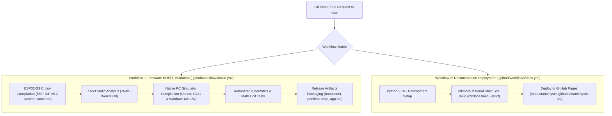

# CI/CD and Automated GitHub Actions

Tamimystic OS maintains an automated, enterprise-grade **Continuous Integration and Continuous Deployment (CI/CD)** pipeline powered by GitHub Actions. Every push and pull request to the `main` branch undergoes rigorous automated cross-compilation, static analysis, unit testing, and documentation deployment.

---

## CI/CD Pipeline Architecture



---

## Workflow 1: Firmware Compilation and Validation

The primary build workflow (`.github/workflows/build.yml`) ensures that no commits introduce compilation errors, compiler warnings, or memory segment overflows:

```yaml
name: ESP32 Firmware Build & Verification

on:
  push:
    branches: [ main ]
  pull_request:
    branches: [ main ]

jobs:
  build-esp32s3:
    name: Build ESP32-S3 Firmware (N16R8 Target)
    runs-on: ubuntu-latest
    container:
      image: espressif/idf:v5.2.1

    steps:
      - name: Checkout Repository
        uses: actions/checkout@v4
        with:
          submodules: recursive

      - name: Configure Target Architecture
        run: |
          . $IDF_PATH/export.sh
          idf.py set-target esp32s3

      - name: Compile Firmware with Strict Warnings
        run: |
          . $IDF_PATH/export.sh
          idf.py build

      - name: Verify Binary Size and Partitions
        run: |
          . $IDF_PATH/export.sh
          idf.py size
          idf.py size-components

      - name: Upload Build Artifacts
        uses: actions/upload-artifact@v4
        with:
          name: tamimystic-os-esp32s3-binaries
          path: |
            build/bootloader/bootloader.bin
            build/partition_table/partition-table.bin
            build/ota_data_initial.bin
            build/tamimystic-os.bin
            build/storage.bin

  build-native-sim:
    name: Build Native PC Simulator
    runs-on: ubuntu-latest

    steps:
      - name: Checkout Repository
        uses: actions/checkout@v4

      - name: Install Build Tools
        run: sudo apt-get update && sudo apt-get install -y cmake build-essential

      - name: Compile Native Simulator
        run: |
          cmake -B build
          cmake --build build -j$(nproc)

      - name: Run Kinematics and Math Unit Tests
        run: |
          ctest --test-dir build --output-on-failure
```

---

## Workflow 2: Automated Documentation Portal Deployment

The documentation workflow (`.github/workflows/docs.yml`) validates all markdown files, mathematical KaTeX blocks, and Mermaid diagrams before publishing live to GitHub Pages:

```yaml
name: Deploy MkDocs Documentation Portal

on:
  push:
    branches: [ main ]

permissions:
  contents: write

jobs:
  deploy-docs:
    runs-on: ubuntu-latest
    steps:
      - name: Checkout Repository
        uses: actions/checkout@v4

      - name: Configure Python
        uses: actions/setup-python@v5
        with:
          python-version: 3.x

      - name: Install MkDocs Material & Plugins
        run: |
          pip install mkdocs-material pymdown-extensions

      - name: Build and Deploy to GitHub Pages
        run: mkdocs gh-deploy --force --clean
```

---

## Local Pre-Commit Verification Checklist

Before pushing commits to GitHub, developers should perform local sanity checks:

### 1. Compile Check (PC Simulator):
```powershell
cmake -B build -G "MinGW Makefiles"
cmake --build build
```

### 2. Compile Check (ESP-IDF v5.2):
```bash
idf.py build
```

### 3. Documentation Build Validation:
```bash
mkdocs build --strict
```
Ensure that no broken links, malformed markdown headers, or missing navigation references exist.
