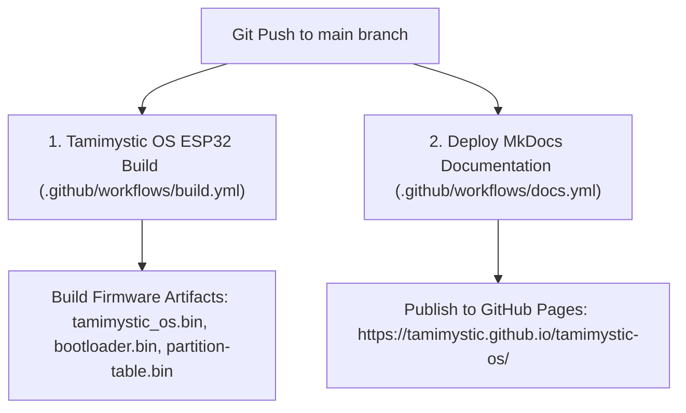

# 🚀 CI/CD Pipeline & GitHub Actions Automation

Tamimystic OS utilizes automated GitHub Actions workflows to continuously compile firmware binaries, run tests, and publish live documentation.

---

## 🔄 Automated Workflows

---

## 📦 Automated Artifacts

Every push or pull request to the `main` branch produces downloadable binary build artifacts attached directly to the GitHub Actions run:

1. `tamimystic_os.bin` (Main Operating System binary)
2. `bootloader.bin` (ESP32-S3 secondary bootloader)
3. `partition-table.bin` (16MB partition map)
4. `tamimystic_os.elf` (Debug symbols for GDB debugging and core-dump analysis)

---

## 🌐 Live Documentation Deployment

Whenever files in the `docs/` folder or `mkdocs.yml` are modified:
1. GitHub Actions triggers `Deploy MkDocs Documentation`.
2. Material for MkDocs builds the static HTML site.
3. The generated site is automatically deployed to the `gh-pages` branch and served globally at:
   👉 **[https://tamimystic.github.io/tamimystic-os/](https://tamimystic.github.io/tamimystic-os/)**
