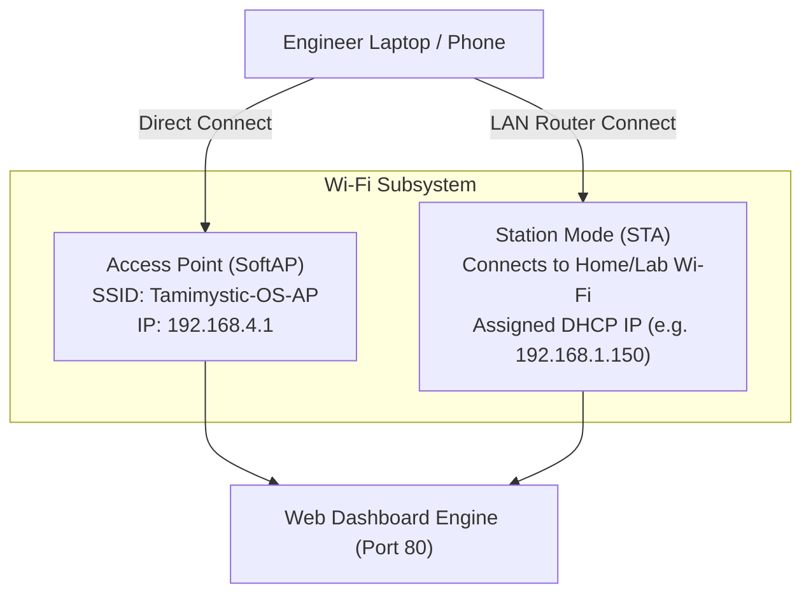

# First Boot and Web Dashboard

Upon flashing Tamimystic OS, the ESP32-S3 executes an automated hardware initialization sequence, starts all background real-time FreeRTOS daemon tasks, and spins up both the Serial CLI and the asynchronous HTTP/WebSocket Web Dashboard server.

---

## Boot Sequence and Console Banner

Connect a serial terminal client (e.g., PuTTY, Tera Term, Minicom, or `idf.py monitor`) to your device's USB port at **115200 baud** (8 data bits, no parity, 1 stop bit).

During a normal startup, you will observe the following boot telemetry log:

```text
===================================================================
  TAMIMYSTIC OS - Edge Robotics & AI Operating System v1.0.0
  Target: ESP32-S3-N16R8 (Xtensa Dual-Core @ 240MHz)
  Flash: 16MB Quad-SPI | PSRAM: 8MB Octal-SPI (Free: 8312 KB)
===================================================================
[INIT] [Core 0] Initializing Non-Volatile Storage (NVS)... [OK]
[INIT] [Core 0] Loading Dynamic Pin Matrix configuration... [OK]
[INIT] [Core 0] Scanning I2C Bus for Plug-and-Play sensors...
       - Found MPU-6050 (6-DOF IMU) at 0x68 [ACTIVE]
       - Found VL53L0X (Laser Distance) at 0x29 [ACTIVE]
       - Found SSD1306 (128x64 OLED) at 0x3C [ACTIVE]
       - Found PCA9685 (16-Ch PWM Servo) at 0x40 [ACTIVE]
[INIT] [Core 1] Initializing 1000Hz Real-Time Motion PID Controller... [OK]
[INIT] [Core 1] Initializing 6-DOF Inverse Kinematics Engine... [OK]
[INIT] [Core 1] Initializing 2D LiDAR SLAM & A* Navigation Grid... [OK]
[INIT] [Core 1] Initializing DVP Camera DMA Framebuffer (PSRAM)... [OK]
[INIT] [Core 1] Initializing MobileNet INT8 Neural Vector Accelerator... [OK]
[INIT] [Core 1] Initializing 16kHz I2S Audio Pipeline & KWS Engine... [OK]
[INIT] [Core 0] Starting ESP-NOW Swarm Mesh Radio (Channel 1)... [OK]
[INIT] [Core 0] Starting Wi-Fi Subsystem in AP+STA Dual-Mode...
       - SoftAP SSID: Tamimystic-OS-AP
       - SoftAP IP:   192.168.4.1
[INIT] [Core 0] Starting HTTP REST Engine on port 80 (70 Handlers)... [OK]
[INIT] [Core 0] Starting WebSocket Telemetry Server on /ws... [OK]
[INIT] [Core 1] Initializing MicroPython Virtual Sandboxed Runtime... [OK]

Tamimystic OS Kernel Boot Completed in 482 ms.
Type 'help' to list available CLI commands.

tamimystic>
```

---

## Network Connection Modes

Tamimystic OS operates in **AP+STA Concurrent Mode** out of the box:



### Mode 1: Direct SoftAP Connection (Out-of-the-Box)
1. On your computer or mobile device, scan for Wi-Fi networks.
2. Connect to the SSID: `Tamimystic-OS-AP`
3. Enter the default WPA2 passphrase: `tamimystic123`
4. Open any modern web browser and navigate to:
   ```
   http://192.168.4.1
   ```

### Mode 2: Connecting to an Existing Local Wi-Fi Network (Station Mode)
To connect Tamimystic OS to your local Wi-Fi router for ROS 2 networking and internet access:

#### Option A: Via Serial CLI
```bash
tamimystic> wifi connect "Your_SSID" "Your_Password"
[WIFI] Connecting to 'Your_SSID'...
[WIFI] Connected! Assigned IP: 192.168.1.150 (Gateway: 192.168.1.1)
```

#### Option B: Via HTTP REST API
```bash
curl -X POST "http://192.168.4.1/api/wifi/connect?ssid=Your_SSID&pass=Your_Password"
```

Once connected, you can access the Web Dashboard from any computer on your local network using the assigned IP (e.g., `http://192.168.1.150`).

---

## Web Dashboard 10-Subsystem Control Matrix

The integrated Single-Page Web Dashboard (`index.html`) is served directly from Flash/ROM and communicates via high-frequency WebSockets (`ws://<device-ip>/ws`) and asynchronous REST endpoints:

```
+----------------------------------------------------------------------------------------------------+
|  TAMIMYSTIC OS - UNIFIED EMBEDDED DASHBOARD                                [Wi-Fi: 192.168.1.150]  |
+------------------------------------+-----------------------------------+---------------------------+
| [CARD 1: SYSTEM TELEMETRY]         | [CARD 2: DYNAMIC PIN MATRIX]      | [CARD 3: PNP SENSORS]     |
| - CPU0: 12% | CPU1: 28% @ 240MHz   | - I2C: SDA=21, SCL=22             | - MPU-6050: Pitch 0.2 deg |
| - PSRAM Free: 7,842 KB / 8,192 KB  | - Motor Left: PWM=6, IN1=4, IN2=5 | - VL53L0X: 452 mm         |
| - Uptime: 01:24:18 | Core Temp: 41C| - Status LED: GPIO 48             | - BME280: 26.4C, 1013 hPa |
+------------------------------------+-----------------------------------+---------------------------+
| [CARD 4: ROBOTICS MOTION CONTROLLER| [CARD 5: 6-DOF ROBOTIC ARM IK]    | [CARD 6: ROS 2 MICRO-ROS] |
| - Chassis: Mecanum / Diff Drive    | - Cartesian: X:150 Y:0 Z:120 mm   | - Agent: 192.168.1.100:888|
| - Linear: 0.50 m/s | Ang: 0.2 rad/s| - Gripper: 45% (Closed)           | - Status: CONNECTED       |
| - Virtual Joystick & E-STOP        | - J1..J6 Interactive Sliders      | - Topics: /cmd_vel, /odom |
+------------------------------------+-----------------------------------+---------------------------+
| [CARD 7: 2D LIDAR SLAM NAVIGATION] | [CARD 8: DVP CAMERA & STREAM]     | [CARD 9: EDGE AI ENGINE]  |
| - 80x80 Occupancy Grid Map Canvas  | - Live 30 FPS MJPEG Stream View   | - Model: MobileNet-V2 INT8|
| - Pose: X:1.20m, Y:0.85m, Th:45deg | - Resolution: QQVGA / VGA         | - Inference: 18 ms (55FPS)|
| - Global Path: A* Target Waypoint  | - Controls: Brightness/Contrast   | - Class: Person (94.2%)   |
+------------------------------------+-----------------------------------+---------------------------+
| [CARD 10: ESP-NOW SWARM MESH]                                                                      |
| - Mode: Swarm Master (Node ID: #1) | Active Peers: 3 Nodes Detected | Channel: 1                   |
| - Peer 02: [SYNCED] RSSI: -48 dBm | Peer 03: [SYNCED] RSSI: -54 dBm | Formation: Wedge           |
+----------------------------------------------------------------------------------------------------+
```

---

## Serial Console Interactive CLI

Tamimystic OS provides an enterprise-grade command-line interface with parameter parsing, help documentation, and safety checks:

```bash
# Display all available kernel command categories
tamimystic> help

# Inspect hardware performance and memory allocations
tamimystic> status

# Query active sensor values
tamimystic> sensor status

# Drive robot forward at 0.5 m/s
tamimystic> motion drive 0.5 0.0

# Trigger emergency motion stop
tamimystic> motion stop

# Solve 6-DOF Inverse Kinematics for target coordinate
tamimystic> arm ik 150.0 0.0 120.0 0.0 45.0 0.0

# Run a live AI classification pass on current camera frame
tamimystic> ai run

# Scan for nearby ESP-NOW Swarm nodes
tamimystic> espnow peers
```

---

## Next Steps

Now that your board is powered, connected to the network, and verified through both the Web Dashboard and Serial Console, proceed to the **[5-Minute Quickstart](quickstart.md)** to run your first autonomous robotics script and sensor data pipeline.
