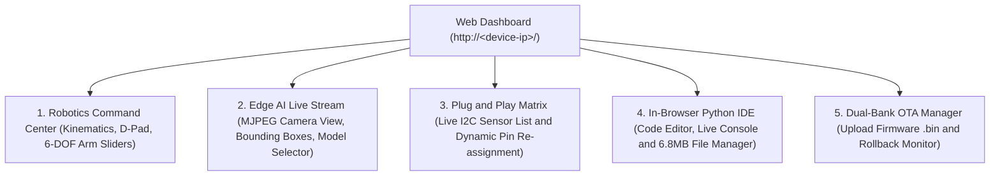

# First Boot and Web Dashboard Walkthrough

Once flashing is complete, Tamimystic OS starts immediately upon reboot. This guide explains what happens during boot, how to connect to the serial console, and how to access the Web Dashboard.

---

## 1. Serial Monitor Output (@ 115200 Baud)

Open your favorite serial terminal (e.g., PuTTY, Arduino Serial Monitor, `idf.py monitor`, or VS Code Serial Monitor) and configure it to:
* **Baud Rate**: `115200`
* **Data Bits**: `8`
* **Parity**: `None`
* **Stop Bits**: `1`

You will see the official Tamimystic OS boot banner:

```text
=======================================================
       TAMIMYSTIC OS - ESP32-S3 ULTRA PRO MAX          
=======================================================
[BOOT] Starting system bring-up sequence...
[EVENT] Event Bus initialized.
[SCHEDULER] Initializing FreeRTOS Scheduler (ESP32)...
[CONFIG] Initializing NVS (Non-Volatile Storage)...
[PNP] Initializing Plug & Play Hardware Engine...
[PIN_MATRIX] Initialized with persistent NVS backing.
[HAL_I2C] Master bus initialized on SDA=21, SCL=22 @ 400kHz.

=======================================================
  [PNP] Scanning I2C Bus (Addresses 0x08 - 0x77)...
=======================================================
  [+ FOUND] 0x68 | MPU-6050 [IMU / Motion] Signature Match!
  [+ FOUND] 0x29 | VL53L0X [Distance / ToF] Signature Match!
  [+ FOUND] 0x3C | SSD1306 [Display / OLED] Signature Match!
  [+ FOUND] 0x40 | PCA9685 [Actuator Expander] Signature Match!
=======================================================
  [PNP] Scan complete. 4 hardware devices auto-configured.
=======================================================

[NET] Initializing ESP32 Network Manager...
[STORAGE] Initializing 6.8MB LittleFS/SPIFFS Partition for ESP32-S3...
[STORAGE] Flash VFS Mounted: Total: 6800 KB, Used: 48 KB
[APPS] Initializing Dynamic Application & Scripting Engine...
[PYTHON] Initializing MicroPython Native Bridge & Runtime...
[WASM] Initializing WebAssembly Sandboxed Micro-Runtime...
[ROBOTICS] Initializing Universal Robot Brain on Core 1...
[SERVO] Auto-linked to PCA9685 16-Channel I2C Servo Expander at 0x40.
[ROBOTICS] Universal Kinematics & Control Engine Active.
[AI] Initializing TensorFlow Lite Micro & ESP-NN SIMD Neural Engine...
[CAMERA] Initializing ESP32-S3 DVP Camera Driver with 8MB Octal PSRAM...
[CAMERA] ESP32-S3 Hardware Camera Pipeline Initialized in PSRAM.
[AI] Edge AI & Vision Pipeline Active on Core 1.
[WEB] Starting ESP32 HTTP Server on Port 80...
[WEB] Universal Robotics, Edge AI, Python IDE & File System endpoints active.
[SYS] Received SYSTEM_BOOT event. System is fully UP & READY!

aeron> 
```

---

## 2. Connecting to the Web Dashboard

Tamimystic OS hosts a high-performance, asynchronous web application directly from flash:

### Step 1: Connect Wi-Fi
Using the serial CLI, connect the OS to your local Wi-Fi network:
```bash
aeron> wifi "MyHomeNetwork" "MySecretPassword"
```
The OS outputs:
```text
[NET] Connecting to Wi-Fi...
[NET] Wi-Fi Connected. Got IP: 192.168.1.142
[SYS] Network is now CONNECTED!
```

### Step 2: Open Dashboard in Browser
Open your web browser (Chrome, Firefox, Safari, Edge) on your phone, tablet, or PC and navigate to:
```text
http://192.168.1.142/
```

---

## 3. Dashboard Features Overview

The Web Dashboard is organized into 5 primary panels:



1. **Universal Robotics**:
   - Live D-Pad virtual joystick for Differential and Mecanum holonomic strafing.
   - 6-DOF Robotic Arm joint angle sliders ($J_1 - J_6$) with real-time degree feedback.
   - Interactive $(X, Y, Z)$ Cartesian Inverse Kinematics target input.
   - Emergency Stop (E-Stop) and Safety Auto-Braking indicator.
2. **Edge AI and Vision Stream**:
   - Real-time video stream from OV2640 / OV3660 camera.
   - Overlaid neural bounding boxes with class labels and confidence percentages.
   - Model switcher (Person Detector, Object Detector, Lane Follower, Gesture Classifier).
   - Auto-Follow Target toggle.
3. **Plug and Play Hardware Matrix**:
   - Interactive table showing all detected I2C sensors with physical addresses and status.
   - Visual software pin matrix: Click any pin (e.g., `MOTOR_L_PWM` or `I2C_SDA`) and assign it to another GPIO without restarting.
4. **Web Python IDE**:
   - Full code editor with syntax highlighting.
   - Direct execution button (`Run Script`) and `Stop` button.
   - Live stdout console streaming print outputs in real-time.
   - Flash file manager to view and delete files in the 6.8MB LittleFS partition.
5. **Dual-Bank OTA**:
   - Single-click binary firmware upload with automatic slot switching and rollback arming.
