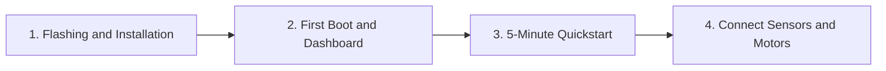

# Getting Started with Tamimystic OS

This section provides everything you need to install, configure, and run Tamimystic OS on your **ESP32-S3-N16R8** development board or test it on your PC using the Native Simulator.

---

## Hardware Prerequisites

To take full advantage of all OS features (Edge AI, Camera, Robotics, and Web IDE), you will need:

1. **Target Board**: **ESP32-S3-DevKitC-1-N16R8** (or any ESP32-S3 board with **16MB Flash** and **8MB Octal PSRAM**).
   - Examples: ESP32-S3-WROOM-1 / WROOM-2 N16R8, Freenove ESP32-S3-WROOM CAM, Waveshare ESP32-S3-DEV.
2. **Camera Sensor (Optional for AI)**: OV2640, OV3660, or OV5640 DVP module.
3. **Actuator and Driver (Optional for Robotics)**:
   - Dual H-Bridge Motor Driver (L298N, TB6612FNG, or DRV8833).
   - PCA9685 16-Channel I2C Servo Controller (for robotic arms or hexapods).
4. **Sensors (Optional for PnP Discovery)**:
   - MPU-6050 (IMU Gyro/Accel), VL53L0X (Laser ToF Distance), BME280 (Temperature/Pressure), SSD1306 OLED (Display).
5. **USB Cable**: High-quality USB-C data cable.

---

## Navigation Guide

Follow these steps in order:

1. **[Flashing and Installation](installation.md)**: Download pre-built binaries and flash them via Web Flasher or `esptool.py`.
2. **[First Boot and Web Dashboard](first-boot.md)**: Connect to the serial console (`115200 baud`) and access the Web Dashboard at `http://192.168.4.1`.
3. **[5-Minute Quickstart](quickstart.md)**: Write your first Python script to drive a robot, blink a status LED, and read live distance sensors.
