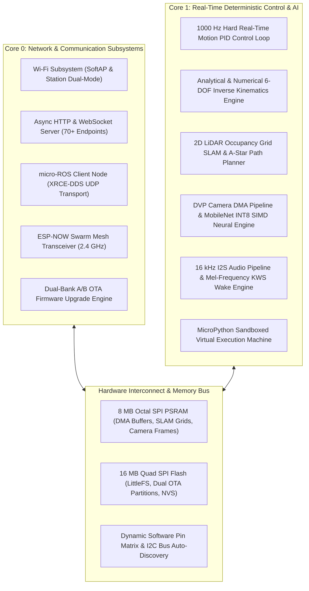
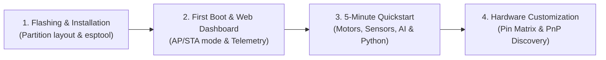

# Getting Started with Tamimystic OS

Tamimystic OS is an industrial-grade, deterministic, dual-core embedded operating system designed specifically for the **ESP32-S3-N16R8** microcontroller. It unifies edge artificial intelligence, 2D LiDAR SLAM, closed-loop robotics kinematics, native ROS 2 micro-ROS connectivity, real-time audio voice control, ESP-NOW swarm mesh communication, and an in-browser Web IDE with embedded MicroPython.

This section provides the complete technical onboarding roadmap, hardware specifications, power budgeting calculations, development prerequisites, and verification steps to deploy Tamimystic OS.

---

## Technical Architecture Overview

Tamimystic OS executes symmetrically across both Xtensa 32-bit LX7 dual cores operating at 240 MHz, utilizing 512 KB internal SRAM and 8 MB Octal SPI High-Speed PSRAM:

---

## Hardware Bill of Materials (BOM)

To utilize all subsystems of Tamimystic OS, the recommended hardware configuration is outlined below:

### 1. Primary Computing Unit
- **Microcontroller**: ESP32-S3-WROOM-1-N16R8 or ESP32-S3-WROOM-2-N16R8
  - **CPU**: Dual-core Xtensa 32-bit LX7 @ 240 MHz (vector SIMD instructions enabled)
  - **Embedded Flash**: 16 MB Quad-SPI (3.3V)
  - **Embedded PSRAM**: 8 MB Octal-SPI (3.3V / high speed)
  - **Wireless**: 2.4 GHz Wi-Fi (802.11 b/g/n) and Bluetooth 5 (LE)
  - **Native USB**: USB-OTG full-speed controller (GPIO 19 D-, GPIO 20 D+)

### 2. Optical Vision Subsystem
- **Camera Sensor**: Omnivision OV2640, OV3660, or OV5640 DVP Module
  - **Interface**: 8-bit parallel Digital Video Port (DVP) with XCLK, PCLK, VSYNC, HREF
  - **Lens**: 68-degree or 120-degree wide-angle FOV
  - **DMA Allocation**: Dual double-buffered line buffers in internal SRAM routed to 8MB PSRAM framebuffer

### 3. Actuation and Motion Subsystem
- **Differential / Mecanum Motor Driver**:
  - Dual H-Bridge Driver: TB6612FNG (recommended for high efficiency, 1.2A continuous per channel) or L298N (2.0A continuous)
  - PWM Switching Frequency: Configurable 1 kHz to 20 kHz (default 10 kHz to eliminate audible motor whine)
- **Robotic Arm & Servo Controller**:
  - PCA9685 16-Channel 12-bit PWM I2C Controller (Default I2C address: `0x40`)
  - Target Servos: MG996R, SG90, or RDS3115 metal-gear servos (5V-7.4V external supply)

### 4. Plug-and-Play Sensor Suite
- **IMU**: InvenSense MPU-6050 (6-DOF Accelerometer + Gyroscope, I2C `0x68`)
- **Distance Measurement**: STMicroelectronics VL53L0X Time-of-Flight Laser Sensor (I2C `0x29`, 2-meter range, millimetric precision)
- **Environment**: Bosch Sensortec BME280 (Temperature, Relative Humidity, Barometric Pressure, I2C `0x76`)
- **Telemetry Display**: Solomon Systech SSD1306 128x64 Monochrome I2C OLED (I2C `0x3C`)
- **2D LiDAR Scanner**: RPLiDAR A1/A2, LD06, D200, or YDLIDAR (UART Serial @ 115200 or 230400 baud)

### 5. Audio and Voice Interface
- **Microphone**: Knowles INMP441 Omnidirectional MEMS Microphone (I2S Digital Input)
- **Speaker Amplifier**: Maxim Integrated MAX98357A 3.2W Class-D I2S Audio Amplifier

---

## Electrical Specifications and Power Budgeting

The ESP32-S3 and its high-current peripherals require strict power isolation to avoid brownout resets:

| Subsystem | Operating Voltage | Peak Current | Continuous Current | Recommended Isolation |
|---|---|---|---|---|
| ESP32-S3 SoC (Wi-Fi TX + PSRAM + SIMD AI) | 3.3V DC | 500 mA | 180 mA | Dedicated 3.3V Low-Dropout Regulator (LDO $\ge$ 1000mA, e.g., AMS1117-3.3 or AP2112K) |
| OV2640 DVP Camera | 3.3V / 2.8V / 1.2V | 140 mA | 60 mA | Decoupled with 10uF tantalum + 0.1uF ceramic capacitors |
| 2D LiDAR Motor & Optical Transceiver | 5.0V DC | 600 mA (spin-up) | 280 mA | Direct 5V rail; do not draw through 3.3V LDO |
| DC Drive Motors (x2 or x4) | 6.0V - 12.0V DC | 2.5 A (stall) | 600 mA | Dedicated LiPo battery (2S 7.4V or 3S 11.1V) with common ground |
| 6-DOF Servos (x6) | 5.0V - 6.0V DC | 4.0 A (full torque) | 1.2 A | Dedicated 5V 5A Buck Converter (e.g., LM2596 or XL4015) |
| I2C Sensor Bus (IMU, ToF, OLED) | 3.3V DC | 25 mA | 12 mA | 3.3V bus with 4.7k-ohm pull-up resistors on SDA and SCL |

> [!CAUTION]
> Never power drive motors or high-torque servos directly from the development board's 5V or 3.3V pins. Inductive back-EMF spikes from DC motors can destroy the ESP32-S3 silicon. Always use a common ground topology with separate power supplies.

---

## Workstation Prerequisites

Tamimystic OS supports cross-platform compilation and deployment on Windows, Linux, and macOS:

### 1. Embedded Target Toolchain (ESP32-S3 Hardware)
- **ESP-IDF Framework**: Version **v5.2.x** (v5.2.1 LTS recommended)
- **Python**: Version 3.10, 3.11, or 3.12 (with virtual environment support)
- **CMake**: Version 3.24 or higher
- **Ninja Build System**: Version 1.10 or higher
- **Serial Flashing Utility**: `esptool.py` v4.7+

### 2. Native Desktop Simulator (PC Environment)
- **Compiler (Windows)**: MinGW-w64 GCC 12.0+ or Microsoft Visual Studio 2022 (MSVC 19.30+)
- **Compiler (Linux / macOS)**: GCC 11.0+ or Clang 14.0+
- **Build System**: CMake 3.24+ and Make/Ninja

---

## Getting Started Workflow

To bring up your system, proceed through the following guides:

1. **[Flashing & Installation](installation.md)**: Flash pre-compiled binary images or compile directly from source code.
2. **[First Boot & Web Dashboard](first-boot.md)**: Connect via Serial console (`115200 baud`) and access the live Web Dashboard.
3. **[5-Minute Quickstart](quickstart.md)**: Execute hands-on tutorials for motor kinematics, sensor polling, neural vision, and MicroPython scripts.
4. **[Dynamic Pin Matrix](file:///I:/tamimystic-os/docs/hardware/pin-matrix.md)**: Configure GPIO multiplexing without re-flashing.
