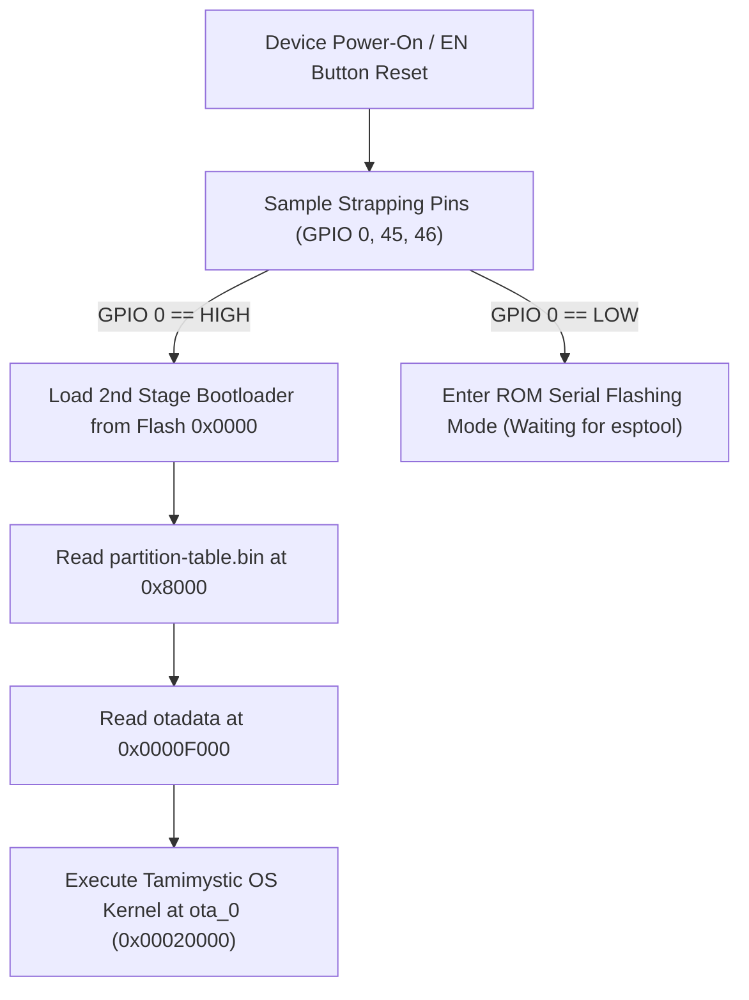

# Flashing and Installation Guide

This guide provides comprehensive instructions for deploying Tamimystic OS onto the **ESP32-S3-N16R8** (16 MB Flash, 8 MB Octal PSRAM) development board.

---

## 16 MB Flash Memory Partition Architecture

Tamimystic OS utilizes a customized partition layout defined in [`partitions.csv`](file:///I:/tamimystic-os/partitions.csv). This configuration enables dual-bank A/B Over-The-Air (OTA) updates, a dedicated deep learning neural network storage partition, and a high-performance LittleFS Virtual File System:

| Partition Name | Type | Subtype | Flash Offset | Partition Size | Hex Size | Purpose |
|---|---|---|---|---|---|---|
| `nvs` | `data` | `nvs` | `0x00009000` | 24 KB | `0x00006000` | Non-Volatile Storage (Wi-Fi credentials, pin mappings, PID gains) |
| `otadata` | `data` | `ota` | `0x0000f000` | 8 KB | `0x00002000` | Active OTA boot slot selection and rollback state machine |
| `phy_init` | `data` | `phy` | `0x00011000` | 4 KB | `0x00001000` | RF calibration and PHY radio initialization data |
| `ota_0` | `app` | `ota_0` | `0x00020000` | 4.5 MB | `0x00480000` | Primary executable firmware application slot A |
| `ota_1` | `app` | `ota_1` | `0x004a0000` | 4.5 MB | `0x00480000` | Secondary executable firmware application slot B (OTA update) |
| `model` | `data` | `undefined` | `0x00920000` | 2.5 MB | `0x00280000` | INT8 Quantized Neural Network models (MobileNet, KWS Audio) |
| `storage` | `data` | `littlefs` | `0x00ba0000` | 4.375 MB | `0x00460000` | LittleFS Flash VFS (MicroPython scripts, Web UI assets, logs) |

```
+--------------------------------------------------------------------------------------------------------+
| 0x00000  | 0x09000 | 0x0F000 | 0x20000        | 0x4A0000       | 0x920000     | 0xBA0000    | 0x1000000|
| Boot     | NVS     | OTAData | Slot A (ota_0) | Slot B (ota_1) | AI Models    | LittleFS VFS| End 16MB |
| & PartTable 24KB   | 8KB     | 4.5 MB         | 4.5 MB         | 2.5 MB       | 4.375 MB    |          |
+--------------------------------------------------------------------------------------------------------+
```

---

## Method 1: Flashing Pre-Compiled Binaries via `esptool.py`

This is the standard and most reliable method for deploying production firmware images.

### Prerequisites
Install Python and the official Espressif flashing tool:
```bash
pip install --upgrade esptool
```

Identify your board's serial port:
- **Windows**: `COM3`, `COM4`, etc. (Check Device Manager under *Ports (COM & LPT)*)
- **Linux**: `/dev/ttyUSB0` or `/dev/ttyACM0` (Run `ls -l /dev/tty*` or `dmesg | tail`)
- **macOS**: `/dev/cu.usbmodem*` or `/dev/cu.usbserial*`

### Step 1: Complete Chip Erase (Recommended for Clean Installation)
Before first flashing, erase the entire 16 MB SPI flash to remove leftover NVS entries or corrupted partition tables:
```bash
esptool.py --chip esp32s3 --port COM4 erase_flash
```

### Step 2: Multi-Binary Flash Command
Execute the unified flashing command with correct offsets matching the partition table:

```bash
esptool.py --chip esp32s3 \
  --port COM4 \
  --baud 921600 \
  --before default_reset \
  --after hard_reset \
  write_flash -z \
  --flash_mode dio \
  --flash_freq 80m \
  --flash_size 16MB \
  0x00000000 bootloader.bin \
  0x00008000 partition-table.bin \
  0x0000d000 ota_data_initial.bin \
  0x00020000 tamimystic-os.bin \
  0x00ba0000 storage.bin
```

> [!NOTE]
> Flashing at `921600 baud` completes a full 16 MB deployment in under 35 seconds. If you experience communication timeouts or CRC errors over long cables, reduce the baud rate to `460800` or `115200`.

---

## Method 2: In-Browser WebSerial Flashing

For zero-install deployments directly from Google Chrome or Microsoft Edge:

1. Open the [Tamimystic OS Web Flasher Portal](https://tamimystic.github.io/tamimystic-os/installer).
2. Connect your ESP32-S3 board to your computer via USB-C.
3. Click **Connect Device** and select the corresponding USB Serial JTAG / UART COM port.
4. Select firmware version (e.g., `Tamimystic OS v1.0.0 Stable (N16R8)`).
5. Click **Program Device**. The Web Flasher performs partition verification, binary upload, and automated reboot.

---

## Method 3: Building and Flashing from Source Code

If you are developing custom C++ drivers or kernel modules:

### Step 1: Set Target Architecture
Ensure your ESP-IDF environment is activated and target is set to `esp32s3`:
```bash
idf.py set-target esp32s3
```

### Step 2: Configure System Settings (Optional)
Inspect or customize system parameters via Kconfig:
```bash
idf.py menuconfig
```
Key verified configurations in `sdkconfig.defaults`:
- `CONFIG_ESP32S3_SPIRAM_SUPPORT=y`
- `CONFIG_SPIRAM_MODE_OCT=y` (Octal PSRAM @ 80 MHz)
- `CONFIG_SPIRAM_SPEED_80M=y`
- `CONFIG_SPIRAM_USE_MALLOC=y` (Allows large heaps in PSRAM)
- `CONFIG_FREERTOS_HZ=1000` (1 ms tick rate for hard real-time kinematics)

### Step 3: Compile, Flash, and Open Monitor
```bash
# Build the entire firmware suite
idf.py build

# Flash and open serial monitor simultaneously
idf.py -p COM4 -b 921600 flash monitor
```

---

## Hardware Strapping Pins and Boot Modes

The ESP32-S3 uses specific strapping pins sampled during hardware reset to determine boot mode:

| Strapping Pin | Function | Normal Boot State | Download Boot State | Technical Note |
|---|---|---|---|---|
| **GPIO 0** | Boot Mode Select | HIGH (Pull-up) | LOW (Connected to GND) | Hold BOOT button while pulsing EN/RESET button to force UART download mode. |
| **GPIO 3** | JTAG / Boot Log | Floating | Floating | Controls initial ROM bootloader verbosity. |
| **GPIO 45** | VDD_SPI Voltage | LOW (3.3V Flash/PSRAM) | LOW | **Do not pull HIGH** (forces 1.8V and will crash 3.3V Flash). |
| **GPIO 46** | ROM Boot Message | LOW (Silent ROM) | Floating | Pull HIGH to enable ROM debug logging. |



---

## Troubleshooting Flashing Errors

### 1. `A fatal error occurred: Failed to connect to ESP32-S3: No serial data received.`
- **Root Cause**: The SoC did not enter serial download mode, or the wrong COM port was selected.
- **Solution**:
  1. Hold down the physical **BOOT** button on the ESP32-S3 board.
  2. Press and release the **RESET / EN** button once.
  3. Release the **BOOT** button.
  4. Run the `esptool.py` or `idf.py flash` command again.

### 2. `Brownout detector was triggered`
- **Root Cause**: Instantaneous current draw exceeded the USB port's current limit (often when initializing Wi-Fi and Octal PSRAM simultaneously).
- **Solution**:
  - Connect the board to a USB 3.0 (Blue) port providing at least 900 mA.
  - Avoid unpowered USB hubs or long, thin USB cables.
  - Add a 100uF electrolytic capacitor across the 3.3V and GND rails on your breadboard.

### 3. `Flash mode mismatch / Corrupted Image CRC`
- **Root Cause**: Board flashed with Quad SPI (QIO) settings instead of Dual SPI (DIO) for bootloader, or 80MHz flash clock is unstable.
- **Solution**: Always ensure `--flash_mode dio` and `--flash_size 16MB` are specified in your flashing arguments.
