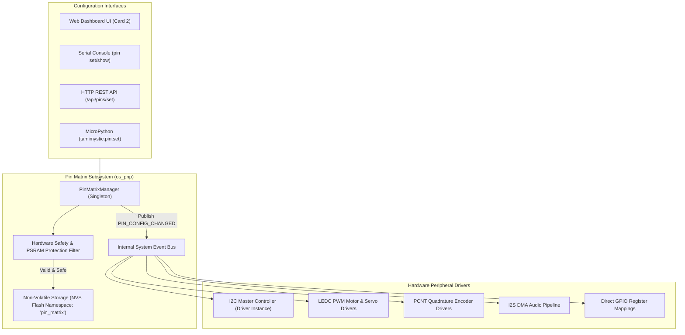

# Dynamic Software Pin Matrix

The **Dynamic Software Pin Matrix** is one of the core innovations of Tamimystic OS. In traditional embedded development, changing peripheral pinout requires modifying source code header macros (`#define MOTOR_PWM_PIN 5`), recompiling the binary, and re-flashing the microcontroller. 

Tamimystic OS decouples hardware drivers from physical pins by introducing an abstract software-defined multiplexer layer. Every peripheral function (I2C SDA/SCL, Motor PWM, Direction GPIOs, Quadrature Encoders, I2S Audio, Ultrasonic Triggers, Status LEDs) is bound to an abstract identifier that can be remapped dynamically at runtime via the Web Dashboard, REST API, CLI, or Python scripts without rebooting or recompiling.

---

## Architectural Theory of Operation

The ESP32-S3 SoC contains a dual-layer pin routing subsystem:
1. **IO MUX**: Connects dedicated high-speed peripherals directly to physical pad registers.
2. **GPIO Matrix**: A 49-channel bidirectional routing matrix that routes any internal digital input or output signal to any physical GPIO pad.

Tamimystic OS interfaces with the ESP32-S3 GPIO Matrix through the `PinMatrixManager` singleton.



### Dynamic Remapping Workflow:
1. **Request Submission**: A configuration change request (e.g. `setPin("i2c_sda", 1)`) is received.
2. **Safety Validation**: The requested GPIO number is evaluated against the `isSafePin()` silicon protection bitmask.
3. **Collision Detection**: The manager verifies that no conflicting peripheral is currently assigned to the target GPIO.
4. **NVS Persistence**: The updated key-value pair is committed to non-volatile flash storage.
5. **Event Bus Broadcast**: The manager dispatches a `PIN_CONFIG_CHANGED` event payload.
6. **Driver Re-initialization**: The active driver deinitializes the previous GPIO pad and binds the new pad in hardware via `gpio_set_direction()`, `gpio_matrix_out()`, and `gpio_matrix_in()`.

---

## Silicon Protection & Octal PSRAM Safety Filter

The ESP32-S3-N16R8 utilizes an ultra-high-speed 80 MHz Octal SPI bus for its 8 MB external PSRAM and Quad SPI bus for its 16 MB Flash memory. Re-assigning or toggling these physical pins will cause an instant hard fault and hardware freeze.

Tamimystic OS enforces a hard-coded silicon safety filter. Any attempt to route peripherals to locked pins is rejected with error code `-1` (`PIN_SAFETY_VIOLATION`):

| Physical GPIO Range | Status | Silicon & Hardware Rationale |
|---|---|---|
| **GPIO 26, 27, 28, 29, 30, 31, 32** | **LOCKED** | Embedded Quad SPI Flash Bus (CS0, CLK, MOSI, MISO, WP, HOLD). |
| **GPIO 33, 34, 35, 36, 37** | **LOCKED** | Embedded Octal SPI PSRAM Bus (D4, D5, D6, D7, DQS). |
| **GPIO 19, 20** | **RESERVED** | Native USB-OTG and JTAG D+/D- Lines (used for console and flashing). |
| **GPIO 45, 46** | **STRAPPING** | Boot Voltage and ROM Boot Strapping Pins (sampled on reset). |
| **GPIO 0** | **STRAPPING** | Boot Mode Select (Active LOW download mode). |
| **GPIO 1 to 18, 21, 38 to 44, 47, 48** | **SAFE** | Fully available for dynamic routing and peripheral assignment. |

---

## Pin Function Enumeration and Default Mappings

The complete list of supported abstract pin functions, their internal string identifiers, default GPIO assignments, and hardware driver associations:

| Pin Function Identifier | String Key | Default GPIO | Driver Module | Description |
|---|---|---|---|---|
| `I2C_SDA` | `i2c_sda` | **GPIO 21** | `os_pnp / I2C0` | I2C Serial Data Bus Master Line |
| `I2C_SCL` | `i2c_scl` | **GPIO 22** | `os_pnp / I2C0` | I2C Serial Clock Bus Master Line |
| `MOTOR_L_IN1` | `motor_l_in1` | **GPIO 4** | `os_motion / GPIO` | Left Motor H-Bridge Forward Direction |
| `MOTOR_L_IN2` | `motor_l_in2` | **GPIO 5** | `os_motion / GPIO` | Left Motor H-Bridge Reverse Direction |
| `MOTOR_L_PWM` | `motor_l_pwm` | **GPIO 6** | `os_motion / LEDC0` | Left Motor Speed PWM (10 kHz, 10-bit resolution) |
| `MOTOR_R_IN3` | `motor_r_in3` | **GPIO 7** | `os_motion / GPIO` | Right Motor H-Bridge Forward Direction |
| `MOTOR_R_IN4` | `motor_r_in4` | **GPIO 15** | `os_motion / GPIO` | Right Motor H-Bridge Reverse Direction |
| `MOTOR_R_PWM` | `motor_r_pwm` | **GPIO 16** | `os_motion / LEDC1` | Right Motor Speed PWM (10 kHz, 10-bit resolution) |
| `SERVO_PWM` | `servo_pwm` | **GPIO 8** | `os_motion / LEDC2` | Direct PWM RC Servo Control (50 Hz, 14-bit) |
| `ENCODER_L_A` | `encoder_l_a` | **GPIO 9** | `os_motion / PCNT0` | Left Wheel Quadrature Encoder Phase A |
| `ENCODER_L_B` | `encoder_l_b` | **GPIO 10** | `os_motion / PCNT0` | Left Wheel Quadrature Encoder Phase B |
| `ENCODER_R_A` | `encoder_r_a` | **GPIO 11** | `os_motion / PCNT1` | Right Wheel Quadrature Encoder Phase A |
| `ENCODER_R_B` | `encoder_r_b` | **GPIO 12** | `os_motion / PCNT1` | Right Wheel Quadrature Encoder Phase B |
| `ULTRASONIC_TRIG` | `ultrasonic_trig` | **GPIO 13** | `os_sensors / RMT` | HC-SR04 Ultrasonic Sensor Trigger Pulse (10us) |
| `ULTRASONIC_ECHO` | `ultrasonic_echo` | **GPIO 14** | `os_sensors / GPIO` | HC-SR04 Ultrasonic Sensor Echo Capture |
| `STATUS_LED` | `status_led` | **GPIO 48** | `os_core / GPIO` | Built-in WS2812 RGB / Direct Digital Status LED |
| `BUZZER` | `buzzer` | **GPIO 38** | `os_audio / LEDC3` | Piezo Alert Buzzer PWM Generator |
| `I2S_BCLK` | `i2s_bclk` | **GPIO 41** | `os_audio / I2S0` | I2S Audio Bit Clock Line |
| `I2S_WS` | `i2s_ws` | **GPIO 42** | `os_audio / I2S0` | I2S Audio Word Select (LRCLK) Line |
| `I2S_DIN` | `i2s_din` | **GPIO 39** | `os_audio / I2S0` | I2S Microphone Data Input (INMP441) |
| `I2S_DOUT` | `i2s_dout` | **GPIO 40** | `os_audio / I2S0` | I2S DAC Speaker Data Output (MAX98357A) |

---

## C++ Driver Programming API

The `PinMatrixManager` is accessible anywhere within the kernel:

```cpp
#include "os_pin_matrix.h"

using namespace TamimysticOS;

void configure_custom_hardware() {
    auto& pin_mgr = PinMatrixManager::getInstance();

    // Query active GPIO for I2C SDA
    int current_sda = pin_mgr.getPin(PinFunction::I2C_SDA);
    printf("Current I2C SDA Pin: GPIO %d\n", current_sda);

    // Validate if GPIO 1 is safe for routing
    if (pin_mgr.isSafePin(1)) {
        // Re-assign I2C SDA to GPIO 1 and persist to NVS
        bool success = pin_mgr.setPin(PinFunction::I2C_SDA, 1);
        if (success) {
            printf("I2C SDA successfully remapped to GPIO 1\n");
        }
    }

    // Retrieve all active mappings
    std::vector<PinMappingItem> mappings = pin_mgr.getAllMappings();
    for (const auto& item : mappings) {
        printf("Func: %-15s -> GPIO %2d (Safe: %s)\n",
               item.func_name.c_str(), item.gpio_pin, item.is_safe ? "YES" : "NO");
    }
}
```

---

## Embedded MicroPython API

Control and query pin matrix configurations directly from Python scripts:

```python
import tamimystic

# Query current pin configuration
sda_pin = tamimystic.pin.get("i2c_sda")
print("I2C SDA is on GPIO:", sda_pin)

# Remap Left Motor PWM to GPIO 8
if tamimystic.pin.is_safe(8):
    success = tamimystic.pin.set("motor_l_pwm", 8)
    print("Remap status:", success)

# Read digital state of a pin
state = tamimystic.pin.read(14)

# Write digital state to a pin
tamimystic.pin.write(48, 1)

# Reset pin matrix to factory defaults
tamimystic.pin.reset_defaults()
```

---

## Serial CLI and HTTP REST API Reference

### Serial CLI Commands:
```bash
# Display full pin matrix table with safety status
tamimystic> pin show

# Output:
# +-----------------+-----------+--------+-------------------------------+
# | Function        | String ID | GPIO   | Status                        |
# +-----------------+-----------+--------+-------------------------------+
# | I2C SDA         | i2c_sda   | 21     | SAFE [ACTIVE]                 |
# | I2C SCL         | i2c_scl   | 22     | SAFE [ACTIVE]                 |
# | Motor Left PWM  | motor_l_pwm| 6     | SAFE [ACTIVE]                 |
# | Status LED      | status_led| 48     | SAFE [ACTIVE]                 |
# +-----------------+-----------+--------+-------------------------------+

# Remap I2C SDA to GPIO 1
tamimystic> pin set i2c_sda 1
[PIN] Function 'i2c_sda' mapped to GPIO 1. Driver reloaded.

# Attempt to assign to a locked PSRAM pin
tamimystic> pin set motor_l_pwm 35
[ERROR] GPIO 35 is LOCKED (Octal PSRAM Bus). Assignment rejected!

# Reset all pins to factory default configuration
tamimystic> pin reset
[PIN] Pin matrix restored to factory defaults.
```

### HTTP REST API Endpoints:

#### 1. Retrieve Complete Pin Matrix JSON
```bash
GET /api/pins
```
**Response JSON:**
```json
{
  "pins": [
    {"function": "i2c_sda", "label": "I2C SDA", "gpio": 21, "safe": true, "desc": "I2C Master Data Line"},
    {"function": "i2c_scl", "label": "I2C SCL", "gpio": 22, "safe": true, "desc": "I2C Master Clock Line"},
    {"function": "motor_l_pwm", "label": "Motor Left PWM", "gpio": 6, "safe": true, "desc": "Left Motor Speed PWM"},
    {"function": "status_led", "label": "Status LED", "gpio": 48, "safe": true, "desc": "RGB Status LED"}
  ]
}
```

#### 2. Remap Pin Assignment
```bash
POST /api/pins/set?func=motor_l_pwm&pin=8
```
**Response JSON:**
```json
{
  "status": "ok",
  "func": "motor_l_pwm",
  "gpio": 8,
  "persisted_to_nvs": true
}
```

#### 3. Reset Pin Matrix to Defaults
```bash
POST /api/pins/reset
```
**Response JSON:**
```json
{
  "status": "ok",
  "message": "Pin matrix reset to factory defaults"
}
```
