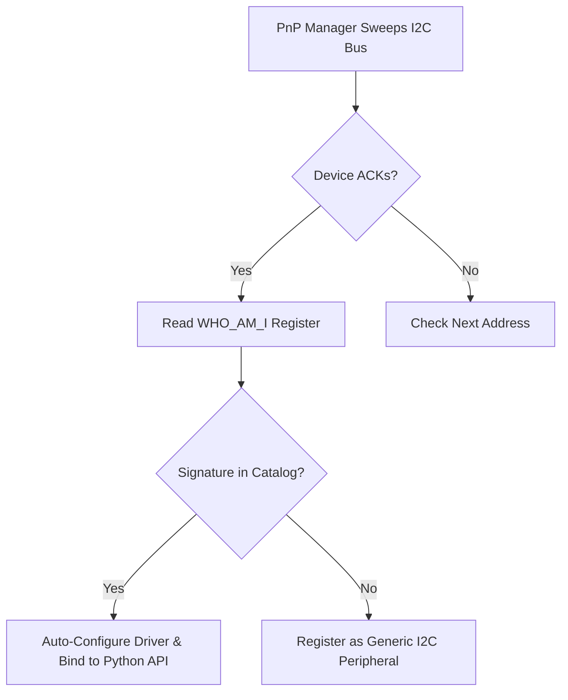

# 🔌 Plug & Play Sensor & Actuator Catalog

Tamimystic OS includes an onboard **Plug & Play (PnP) Registry** containing hardware identification signatures for 15+ industry-standard I2C sensors and expansion modules.

---

## 🔍 How Auto-Discovery Works

During boot (or when triggered via Web Dashboard / CLI `pnp scan`):
1. The OS performs an active hardware sweep across I2C addresses `0x08` through `0x77`.
2. When an ACK is received on an address, the PnP Registry reads the device's unique **WHO_AM_I** / Chip ID register.
3. If a known signature is matched, the OS automatically instantiates and binds the appropriate C++ driver.



---

## 📚 Supported Hardware Catalog

| I2C Address | Device Name | Category | Primary Function | Typical Use Cases |
|---|---|---|---|---|
| `0x68` / `0x69` | **MPU-6050** | IMU / Motion | 6-Axis Accelerometer + 3-Axis Gyroscope | Self-balancing robot, rover tilt detection, quadcopter flight stabilization |
| `0x76` / `0x77` | **BME280 / BMP280** | Environmental | High-precision Temperature, Humidity & Barometric Pressure | Weather station, drone altitude estimation |
| `0x3C` / `0x3D` | **SSD1306** | Display | $128 \times 64$ Monochrome I2C OLED Display | Live IP display, telemetry HUD, battery gauge |
| `0x29` | **VL53L0X** | Distance / ToF | Time-of-Flight Laser Distance Ranging ($2\text{ cm} - 200\text{ cm}$) | Collision avoidance bumper, wall following |
| `0x40` | **PCA9685** | Actuator Expander | 16-Channel 12-bit PWM / Servo Expander | 6-DOF Robotic arms, hexapods, pan-tilt gimbals |
| `0x48` | **ADS1115** | ADC / Sensor | 16-Bit 4-Channel Precision Analog-to-Digital Converter | Analog sensor expansion, current sensing |
| `0x23` | **BH1750** | Optical | Ambient Light Lux Sensor (0 - 65,535 lx) | Smart solar tracking, automated lighting |
| `0x57` | **MAX30102** | Biomedical | High-Sensitivity Optical Heart-Rate & SpO2 Sensor | Wearable health tracking, pulse monitoring |
| `0x50` / `0x57` | **AT24C32 / AT24C256** | Storage | External I2C EEPROM Memory | Non-volatile calibration storage |

---

## 🔌 Wiring Diagram: Connecting Multiple Sensors to One I2C Bus

Because I2C is a bus-based protocol, all sensors share the same two lines (`SDA` and `SCL`) with unique addresses:

```text
ESP32-S3                   MPU-6050         VL53L0X         SSD1306 OLED
+--------------+          +----------+     +---------+     +------------+
|  3V3 / 5V    | -------- | VCC      | --- | VIN     | --- | VCC        |
|  GND         | -------- | GND      | --- | GND     | --- | GND        |
|  GPIO 21 (SDA)| ------- | SDA      | --- | SDA     | --- | SDA        |
|  GPIO 22 (SCL)| ------- | SCL      | --- | SCL     | --- | SCL        |
+--------------+          +----------+     +---------+     +------------+
                          (Addr: 0x68)     (Addr: 0x29)    (Addr: 0x3C)
```

---

## 💻 CLI & API Usage

```bash
# Trigger an active bus scan
aeron> pnp scan

# List all discovered devices
aeron> pnp list
```

### JSON Output from Web API (`GET /api/pnp/devices`):
```json
{
  "status": "ok",
  "count": 3,
  "devices": [
    {"address": "0x68", "name": "MPU-6050", "category": "IMU / Motion", "active": true},
    {"address": "0x29", "name": "VL53L0X", "category": "Distance / ToF", "active": true},
    {"address": "0x40", "name": "PCA9685", "category": "Actuator Expander", "active": true}
  ]
}
```
