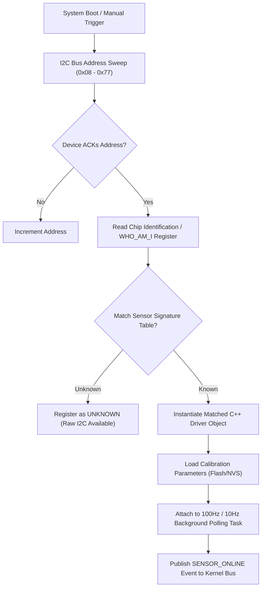

# Plug-and-Play Sensor Auto-Discovery Engine

Tamimystic OS features a native **Plug-and-Play (PnP) Sensor Auto-Discovery Subsystem** (`os_sensors` and `os_pnp`). The OS continuously manages and discovers connected I2C, SPI, and UART peripherals at boot and runtime without requiring manual firmware modifications or sensor-specific driver compilation.

---

## Auto-Discovery & Bus Arbitration Architecture

The PnP discovery engine executes an address sweep across the 7-bit standard I2C address space (`0x08` to `0x77`) during kernel startup or upon receiving a manual scan request.



---

## Supported Sensor Catalog and Register Specifications

The operating system includes built-in, non-blocking asynchronous drivers for the following standard robotics sensors:

### 1. InvenSense MPU-6050 (6-DOF Accelerometer + Gyroscope)
- **Primary I2C Address**: `0x68` (AD0 pulled LOW) | `0x69` (AD0 pulled HIGH)
- **Chip Signature**: Register `0x75` (`WHO_AM_I`) returns `0x68`.
- **Sampling Rate**: 100 Hz deterministic FreeRTOS hardware timer task.
- **Register Architecture**:
  - `0x6B` (`PWR_MGMT_1`): Cleared to `0x00` to wake device from sleep mode.
  - `0x1B` (`GYRO_CONFIG`): Set to `0x08` for $\pm 500^\circ/\text{s}$ full-scale range ($65.5\text{ LSB}/(^\circ/\text{s})$).
  - `0x1C` (`ACCEL_CONFIG`): Set to `0x08` for $\pm 4\text{g}$ full-scale range ($8192\text{ LSB}/\text{g}$).
  - `0x3B` to `0x40`: 16-bit signed Big-Endian Accelerometer registers ($X, Y, Z$).
  - `0x43` to `0x48`: 16-bit signed Big-Endian Gyroscope registers ($X, Y, Z$).
- **Complementary Filter Algorithm**:
  $$\theta_{k} = \alpha \cdot (\theta_{k-1} + \omega \cdot \Delta t) + (1 - \alpha) \cdot \theta_{\text{accel}}$$
  where $\alpha = 0.98$ to reject high-frequency linear acceleration noise while eliminating low-frequency gyroscope integration drift.

---

### 2. STMicroelectronics VL53L0X (Time-of-Flight Laser Distance)
- **Primary I2C Address**: `0x29`
- **Chip Signature**: Register `0xC0` (`IDENTIFICATION_MODEL_ID`) returns `0xEE`.
- **Measurement Principle**: 940 nm VCSEL infrared photon Time-of-Flight measurement across a SPAD array.
- **Operating Range**: 30 mm to 2000 mm (High Accuracy mode: $\pm 3\text{ mm}$ error).
- **Timing Budget**: 33 ms per measurement cycle.
- **Register Architecture**:
  - Dynamic SPAD selection and reference calibration loaded into internal RAM at boot.
  - Continuous ranging mode started by writing `0x02` to `0x80`.
  - Interrupt status polled via register `0x13` (`RESULT_INTERRUPT_STATUS_GPIO`).

---

### 3. Bosch Sensortec BME280 (Temperature, Humidity, Barometric Pressure)
- **Primary I2C Address**: `0x76` (SDO to GND) | `0x77` (SDO to 3.3V)
- **Chip Signature**: Register `0xD0` (`ID`) returns `0x60` (or `0x58` for BMP280).
- **Sampling Rate**: 10 Hz background cycle.
- **Measurement Ranges**:
  - Temperature: $-40^\circ\text{C}$ to $+85^\circ\text{C}$ ($\pm 0.5^\circ\text{C}$)
  - Pressure: $300\text{ hPa}$ to $1100\text{ hPa}$ (Used for relative barometric altitude estimation)
  - Humidity: $0\%$ to $100\%\text{ RH}$ ($\pm 3\%$)
- **Barometric Altimeter Derivation**:
  $$h = 44330 \cdot \left(1 - \left(\frac{P}{P_0}\right)^{\frac{1}{5.255}}\right)$$
  where $P_0 = 1013.25\text{ hPa}$ represents sea-level standard atmospheric pressure.

---

### 4. Solomon Systech SSD1306 (128x64 Monochrome OLED Display)
- **Primary I2C Address**: `0x3C` (SA0 to GND) | `0x3D` (SA0 to 3.3V)
- **Frame Buffer Memory**: $128 \times 64 \text{ bits} = 1024\text{ bytes}$ arranged in 8 horizontal pages (Page 0 to 7).
- **Communication Pipeline**: I2C Burst Transfer at 400 kHz Fast Mode.
- **Onboard Rendering Engine**: Supports system telemetry, IP address display, battery voltage bar, and mini SLAM map rendering.

---

### 5. NXP PCA9685 (16-Channel 12-Bit PWM Servo Driver)
- **Primary I2C Address**: `0x40` (Configurable up to `0x7F` via address solder jumpers A0-A5).
- **PWM Resolution**: 12-bit (4096 discrete steps per channel).
- **Internal Oscillator**: 25 MHz internal clock with programmable prescaler.
- **Servo Frequency Setting**:
  $$\text{Prescaler} = \text{round}\left(\frac{25000000}{4096 \cdot 50}\right) - 1 = 121 \quad (\text{for } 50\text{ Hz RC Servos})$$
- **Channel Register Structure**: Each channel occupies 4 registers (`ON_L`, `ON_H`, `OFF_L`, `OFF_H`) for phase-shifted PWM generation.

---

### 6. Texas Instruments ADS1115 (16-Bit 4-Channel Precision ADC)
- **Primary I2C Address**: `0x48` (ADDR to GND) | `0x49` (ADDR to VDD)
- **Resolution**: 16-bit Delta-Sigma ADC (860 samples/sec max).
- **Programmable Gain Amplifier (PGA)**: $\pm 256\text{ mV}$ to $\pm 6.144\text{ V}$.
- **Use Case**: Analog battery voltage monitoring, high-precision analog distance sensors, and current sensing shunts.

---

## Sensor Calibration Architecture

Tamimystic OS provides non-volatile bias estimation routines to eliminate sensor offsets:

### IMU Zero-Rate Gyroscope & Accelerometer Calibration:
1. Keep the robot completely stationary on a flat, level surface.
2. Execute the calibration routine via CLI (`sensor calibrate imu`) or REST API (`POST /api/sensors/calibrate`).
3. The kernel collects 500 consecutive samples, computes the arithmetic mean $\mu_x, \mu_y, \mu_z$, and commits the bias offsets to NVS flash storage.
4. On subsequent boots, these offsets are automatically subtracted in hardware driver interrupts.

---

## MicroPython Sensor Programming API

Access live sensor readings from custom Python scripts running on Core 1:

```python
import tamimystic
import time

# Trigger manual bus scan
devices = tamimystic.sensor.scan()
print("Discovered Devices:", devices)

# Read IMU Pitch, Roll, Yaw (degrees)
imu_data = tamimystic.sensor.get_imu()
print(f"Roll: {imu_data['roll']:.2f}, Pitch: {imu_data['pitch']:.2f}, Yaw: {imu_data['yaw']:.2f}")

# Read Laser Distance in millimeters
distance = tamimystic.sensor.get_distance_mm()
print(f"ToF Distance: {distance} mm")

# Read Environmental Metrics
env = tamimystic.sensor.get_environment()
print(f"Temperature: {env['temp_c']:.1f} C, Pressure: {env['pressure_hpa']:.1f} hPa")

# Display custom text on SSD1306 OLED
tamimystic.sensor.oled_clear()
tamimystic.sensor.oled_print(0, 0, "TAMIMYSTIC OS")
tamimystic.sensor.oled_print(0, 16, f"Dist: {distance} mm")
tamimystic.sensor.oled_flush()
```

---

## Serial CLI and HTTP REST API Reference

### Serial CLI Commands:
```bash
# Scan I2C bus and list all discovered peripherals
tamimystic> sensor scan

# Query live telemetry from all active sensors
tamimystic> sensor status

# Query IMU 6-DOF data specifically
tamimystic> sensor imu

# Query Laser Distance sensor
tamimystic> sensor distance

# Run zero-rate IMU bias calibration
tamimystic> sensor calibrate
```

### HTTP REST API Endpoints:

#### 1. Get Complete Unified Sensor Telemetry
```bash
GET /api/sensors
```
**Response JSON:**
```json
{
  "imu": {
    "accel_x": 0.02,
    "accel_y": -0.01,
    "accel_z": 0.98,
    "gyro_x": 0.1,
    "gyro_y": -0.2,
    "gyro_z": 0.0,
    "roll_deg": 0.42,
    "pitch_deg": -1.18,
    "yaw_deg": 45.80
  },
  "distance_mm": 452,
  "environment": {
    "temperature_c": 26.40,
    "humidity_pct": 55.20,
    "pressure_hpa": 1013.25,
    "altitude_m": 42.5
  },
  "devices_online": ["MPU-6050", "VL53L0X", "SSD1306", "PCA9685"]
}
```

#### 2. Trigger I2C Discovery Sweep
```bash
POST /api/sensors/scan
```

#### 3. Trigger IMU Calibration
```bash
POST /api/sensors/calibrate
```
