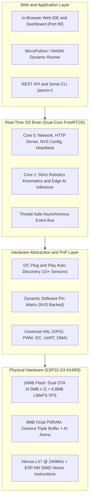

# Welcome to Tamimystic OS

**Tamimystic OS** is a next-generation, full-stack edge robotics and artificial intelligence operating system designed specifically for the **ESP32-S3-N16R8** microcontroller (Xtensa dual-core 32-bit LX7 @ 240MHz, 16MB Quad-SPI Flash, 8MB Octal-SPI PSRAM).

* **Documentation Website**: [https://tamimystic.github.io/tamimystic-os/](https://tamimystic.github.io/tamimystic-os/)
* **GitHub Repository**: [https://github.com/tamimystic/tamimystic-os](https://github.com/tamimystic/tamimystic-os)

---

## What Makes Tamimystic OS Unique?

In standard embedded development, changing a single pin assignment, adding a new sensor, or adjusting a robot's PID gain requires:
1. Modifying C++ code
2. Recompiling the entire project
3. Connecting a USB cable
4. Flashing the chip and waiting for reboot

### The "Flash Once, Configure Infinitely" Principle
With **Tamimystic OS**, you flash the binary to your ESP32-S3 **just once**. From that moment forward:
* **Hardware is Dynamic**: Swap sensors or rewire pins on the fly—the OS discovers I2C devices automatically and allows software pin re-routing saved directly to NVS memory.
* **Robotics is Universal**: Switch from a 2WD differential car to a 4WD Mecanum holonomic rover or a 6-DOF robotic arm with a single command or web toggle.
* **AI Runs on Edge**: Run onboard object detection, person tracking, and lane following at 20+ FPS with zero cloud dependency.
* **Logic is Written in Python**: Write and upload Python control scripts directly inside your web browser via the built-in Web IDE.

---

## System Architecture

---

## Documentation Roadmap

| Section | Description |
|---|---|
| **[Getting Started](getting-started/index.md)** | Step-by-step flashing guide, first boot walkthrough, web dashboard connection, and a 5-minute quickstart tutorial. |
| **[Hardware and Pin Matrix](hardware/pin-matrix.md)** | Learn how runtime pin remapping works, Octal PSRAM protection, and view the 15+ Plug and Play sensor database. |
| **[Robotics Control Engine](robotics/overview.md)** | Explore 2WD/4WD rovers, Mecanum omnidirectional kinematics, 6-DOF robotic arm analytical IK solver, and safety auto-brake. |
| **[Edge AI and Vision](ai-vision/camera.md)** | High-speed DVP camera pipeline, PSRAM triple buffering, MobileNet models, and autonomous visual target tracking. |
| **[Python and Web IDE](apps/micropython.md)** | MicroPython API reference (`tamimystic.*`), in-browser Web IDE, 6.8MB LittleFS Flash VFS, and Dual-Bank OTA. |
| **[API and CLI Reference](reference/cli.md)** | Comprehensive documentation of all serial CLI commands and HTTP REST endpoints with JSON payloads. |
| **[Developer Guide](development/build.md)** | Guide to compiling from source for physical ESP32-S3 or Native PC simulation (Windows/Linux). |
| **[Future Roadmap](roadmap.md)** | In-depth engineering blueprint for micro-ROS, 2D LiDAR SLAM, and Voice AI. |

---

Ready to get started? Head straight to **[Getting Started -> Flashing and Installation](getting-started/installation.md)**!
