# Welcome to Tamimystic OS

**Tamimystic OS** is an industrial-grade, full-stack edge robotics and artificial intelligence operating system engineered specifically for the **ESP32-S3-N16R8** microcontroller architecture (Xtensa dual-core 32-bit LX7 @ 240MHz with Vector Extensions, 16MB Quad-SPI Flash, and 8MB Octal-SPI PSRAM).

[](https://github.com/tamimystic/tamimystic-os/actions/workflows/build.yml)
[](https://github.com/tamimystic/tamimystic-os/actions/workflows/docs.yml)
[](https://opensource.org/licenses/MIT)

* **Documentation Portal**: [https://tamimystic.github.io/tamimystic-os/](https://tamimystic.github.io/tamimystic-os/)
* **GitHub Repository**: [https://github.com/tamimystic/tamimystic-os](https://github.com/tamimystic/tamimystic-os)

---

## The Paradigm: Flash Once, Configure Infinitely

Traditional embedded development cycles for robotics require modifying C/C++ source code, rebuilding the toolchain, connecting physical debuggers, and flashing binary images for minor alterations such as pin reassignments, sensor additions, or PID tuning.

**Tamimystic OS** introduces a unified, modular architecture that turns the microcontroller into a dynamically configurable robotics server:

1. **Dynamic Hardware Pin Matrix**: Every peripheral (PWM motor channels, I2C buses, UART interfaces, DVP camera buses, and I2S audio channels) can be dynamically remapped via Web GUI, REST API, or CLI, and persisted into non-volatile storage (NVS) without rebooting or recompiling.
2. **Universal Robotics Kinematics Engine**: Supports Differential Drive (2WD/4WD), Holonomic Mecanum Drive, 6-DOF Robotic Arm Inverse Kinematics (IK), and Self-Balancing bots inside a unified 50Hz real-time execution loop.
3. **Hardware Plug & Play Auto-Discovery**: Automatically scans standard buses upon boot, identifies connected sensor silicon (e.g., MPU-6050, VL53L0X, BME280, SSD1306, PCA9685, INMP441), loads calibrated drivers, and exposes telemetry over REST, WebSockets, and ROS2.
4. **On-Device Edge AI and Computer Vision**: Accelerates quantized TensorFlow Lite Micro models using Xtensa ESP-NN vector SIMD instructions, performing real-time person detection, target tracking, and 16kHz audio keyword spotting directly on the edge.
5. **Distributed Robotics & Mesh Swarm**: Native micro-ROS client integration for ROS 2 Humble/Iron/Jazzy, 2D LiDAR SLAM with A* path planning, and ultra-low-latency (< 4ms) 2.4GHz ESP-NOW multi-robot swarm mesh.
6. **In-Browser Web IDE & Dynamic Scripting**: Built-in MicroPython and WebAssembly execution sandboxes allowing field logic updates via the browser with a 6.8MB LittleFS virtual filesystem and Dual-Bank A/B OTA recovery.

---

## Comprehensive System Architecture

```mermaid
graph TB
    subgraph Layer4["Application and Connectivity Layer"]
        UI["In-Browser Web IDE & Teleoperation Dashboard (Port 80)"]
        REST["HTTP REST API (70+ Endpoints)"]
        CLI["Interactive Serial CLI (aeron> 115200 Baud)"]
        PY["MicroPython Engine & WebAssembly VM"]
        ROS2["micro-ROS XRCE-DDS Client (6 Topics)"]
        MESH["ESP-NOW Swarm Mesh (< 4ms RF Latency)"]
    end

    subgraph Layer3["Dual-Core Real-Time Execution Engine"]
        CORE0["Core 0 (System & Comms)
- FreeRTOS Preemptive Scheduler
- Web Server & REST Dispatcher
- micro-ROS & ESP-NOW Mesh Tasks
- NVS Key-Value Store & LittleFS VFS"]
        CORE1["Core 1 (Real-Time Autonomy & AI)
- 50Hz Robotics Kinematics & PID Loop
- 6-DOF Analytical Inverse Kinematics
- 20+ FPS Edge AI Vision Pipeline
- 2D LiDAR SLAM & A* Navigation
- 16kHz Audio Keyword Spotting (KWS)"]
        BUS["Thread-Safe Asynchronous Event Bus (Zero-Copy)"]
    end

    subgraph Layer2["Hardware Abstraction & PnP Layer"]
        PNP["I2C / SPI Plug & Play Device Registry"]
        MATRIX["Dynamic Software Pin Matrix (Hardware Protected)"]
        HAL["Universal HAL (GPIO, PWM, I2C, UART, SPI, I2S, DVP, DMA)"]
    end

    subgraph Layer1["Target Silicon & Memory Layout (ESP32-S3-N16R8)"]
        FLASH["16MB Flash:
- Bootloader & NVS (64KB)
- OTA Bank 0 (4.5MB)
- OTA Bank 1 (4.5MB)
- LittleFS VFS (6.8MB)"]
        PSRAM["8MB Octal-SPI PSRAM:
- Camera Framebuffers (QVGA/VGA Triple Buffer)
- SLAM Occupancy Grid Map (200x200 Cells)
- TensorFlow Lite Tensor Arena (2MB)
- MicroPython Heap & Dynamic Allocations"]
        CHIP["Xtensa Dual-Core 32-bit LX7 @ 240MHz (512KB SRAM)"]
    end

    Layer4 --> Layer3
    Layer3 --> Layer2
    Layer2 --> Layer1
```



---

## Memory Allocation and Flash Partition Map

The default partition scheme is optimized for the **16MB Flash** and **8MB PSRAM** configuration:

| Partition Name | Type | Subtype | Flash Offset | Allocated Size | Description |
|---|---|---|---|---|---|
| `nvs` | `data` | `nvs` | `0x009000` | 28 KB (`0x007000`) | Non-volatile storage for pin matrices, calibration, and Wi-Fi credentials. |
| `otadata` | `data` | `ota` | `0x010000` | 8 KB (`0x002000`) | Dual-bank OTA boot slot state machine. |
| `phy_init` | `data` | `phy` | `0x012000` | 4 KB (`0x001000`) | Physical RF calibration data. |
| `app0` | `app` | `ota_0` | `0x020000` | 4,500 KB (~4.4 MB) | Primary active firmware execution slot. |
| `app1` | `app` | `ota_1` | `0x485000` | 4,500 KB (~4.4 MB) | Secondary recovery and background update slot. |
| `storage` | `data` | `spiffs` | `0x8EA000` | 6,800 KB (~6.6 MB) | LittleFS user virtual filesystem for Python scripts, assets, and neural weights. |

---

## Master Subsystem Matrix

| Subsystem | Primary Core | Update Frequency | Key Capabilities |
|---|---|---|---|
| **Pin Matrix & PnP** | Core 0 | Event-Driven | Dynamic GPIO remapping, safety locks for Octal PSRAM/Flash pins, I2C bus device discovery ($0x08 - 0x77$). |
| **Robotics Kinematics** | Core 1 | 50 Hz (20 ms) | Differential drive, Mecanum 4WD matrix transformation, 6-DOF geometric IK, dynamic acceleration ramp, auto-brake. |
| **Edge AI Vision** | Core 1 | 20+ FPS | DVP hardware DMA capture, MobileNet-V2 quantized detection, Proportional-Derivative (PD) visual target tracking. |
| **micro-ROS (ROS 2)** | Core 0 | 50 Hz | Native Micro XRCE-DDS client over UDP/Wi-Fi, 6 standard ROS2 topics (`/cmd_vel`, `/odom`, `/joint_states`, `/imu/data`, etc.). |
| **2D LiDAR & SLAM** | Core 1 | 10 Hz | UART DMA driver for RPLiDAR/LD19, $200 \times 200$ occupancy grid map ($10\text{ m} \times 10\text{ m}$ @ $5\text{ cm}$), Bresenham ray-casting, A* path planning. |
| **Audio Edge AI** | Core 1 | 20 Hz / 16 kHz | I2S MEMS microphone (INMP441), I2S DAC (MAX98357A), neural Keyword Spotting (KWS), formant speech synthesizer. |
| **ESP-NOW Swarm** | Core 0 | 50 Hz | Connectionless 2.4GHz RF mesh, Leader-Follower relative kinematics, triangle/line/column/diamond formations, gamepad teleop. |
| **Python & Web IDE** | Core 0 | On-Demand | In-browser code editor, MicroPython runtime, `tamimystic.*` hardware standard library, asynchronous task execution. |
| **HTTP Web Server** | Core 0 | Event-Driven | Embedded HTTP server with 70 URI handlers, interactive HTML5 Canvas dashboard, real-time REST API. |
| **OTA & Diagnostics** | Core 0 | Event-Driven | Dual-bank A/B firmware swapping with automatic rollback on boot failure, flash wear leveling, memory audits. |

---

## Documentation Directory Structure

```text
docs/
├── index.md                        # Master overview and system architecture
├── getting-started/
│   ├── index.md                    # Prerequisites, hardware BOM, and toolchains
│   ├── installation.md             # Flashing binaries and flashing from source
│   ├── first-boot.md               # Wi-Fi setup, serial shell, and dashboard connection
│   └── quickstart.md               # 5-minute rover teleoperation tutorial
├── hardware/
│   ├── pin-matrix.md               # Dynamic GPIO matrix and Octal PSRAM protection
│   └── pnp-sensors.md              # Plug & Play sensor database and I2C registers
├── robotics/
│   ├── overview.md                 # Universal robot brain architecture
│   ├── kinematics.md               # Differential and Mecanum mathematics
│   ├── arm-ik.md                   # 6-DOF arm analytical inverse kinematics solver
│   ├── ros2.md                     # micro-ROS configuration and ROS 2 ecosystem
│   ├── slam-nav.md                 # 2D LiDAR, Bresenham raycasting, and A* navigation
│   └── espnow-swarm.md             # ESP-NOW mesh swarm and wireless gamepad remote
├── ai-vision/
│   ├── camera.md                   # DVP interface, DMA capture, and PSRAM streaming
│   ├── neural-models.md            # MobileNet-V2 quantized inference pipeline
│   ├── visual-tracking.md          # Autonomous target following and visual servoing
│   └── voice-audio.md              # I2S drivers, neural KWS, and speech synthesis
├── apps/
│   ├── micropython.md              # MicroPython runtime and tamimystic API reference
│   ├── web-ide.md                  # In-browser IDE, VFS file manager, and editor
│   └── ota-updates.md              # Dual-bank OTA firmware update state machine
├── reference/
│   ├── cli.md                      # Serial CLI command manual (aeron>)
│   └── rest-api.md                 # HTTP REST API endpoints and JSON schemas
├── development/
│   ├── build.md                    # Building from source on PC and ESP32-S3
│   └── cicd.md                     # GitHub Actions workflow and automated testing
└── roadmap.md                      # Engineering roadmap and phased delivery
```

---

## Getting Started

To flash Tamimystic OS to your hardware immediately, proceed to **[Getting Started: Flashing and Installation](getting-started/installation.md)**.
