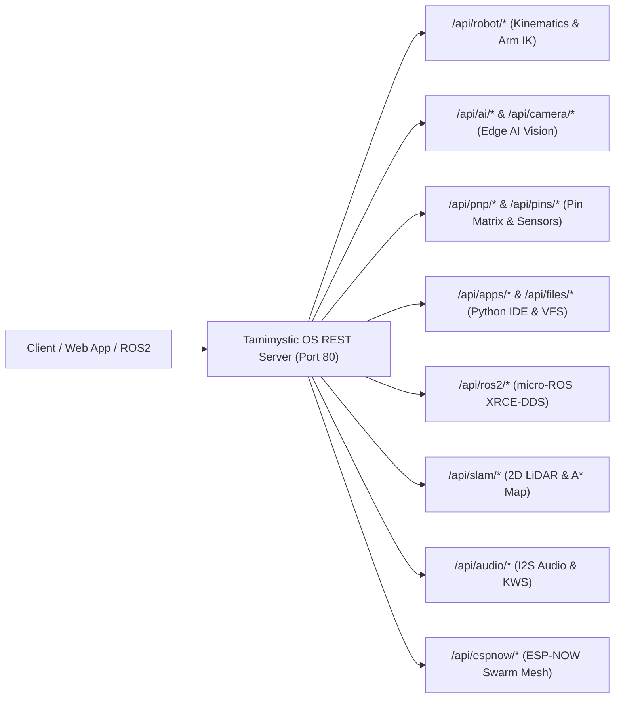

# HTTP REST API and Web Endpoints Reference

Tamimystic OS hosts a high-performance HTTP REST server listening on **Port 80** (physical ESP32-S3) and **Port 8080** (Native PC simulation).

All endpoints return JSON responses with standard CORS headers (`Access-Control-Allow-Origin: *`), enabling zero-configuration integration with custom frontends, web apps, Python scripts, ROS 2 bridges, and mobile apps.

---

## Global API Endpoint Directory



---

## 1. Robotics and Kinematics Endpoints

### `GET /api/robot/telemetry`
Returns the real-time kinematics state, wheel speeds, arm joint angles, and obstacle distances.

* **Method**: `GET`
* **Response Body**:
```json
{
  "status": "ok",
  "mode": "Mecanum 4WD (Holonomic)",
  "mode_id": 1,
  "twist": {
    "vx": 50.0,
    "vy": -20.0,
    "omega": 10.0
  },
  "wheels": {
    "fl": 20.0,
    "fr": 80.0,
    "rl": 80.0,
    "rr": 20.0
  },
  "arm_pose": {
    "x": 18.0,
    "y": 0.0,
    "z": 12.0,
    "pitch": 0.0,
    "gripper": 50.0
  },
  "arm_joints": {
    "j1": 90.0,
    "j2": 42.1,
    "j3": 95.8,
    "j4": -47.9,
    "j5": 90.0,
    "j6": 50.0
  },
  "obstacle_dist_cm": 38.5,
  "e_stop": false,
  "braking": false,
  "active_time_ms": 124500
}
```

### `POST /api/robot/cmd_vel`
Commands linear and angular velocity vectors to the mobile base.

* **Parameters**:
  * `vx` (float, required): Forward/backward linear velocity ($-100.0$ to $+100.0\text{ cm/s}$).
  * `vy` (float, optional): Lateral strafe velocity for Mecanum drive ($-100.0$ to $+100.0\text{ cm/s}$).
  * `w` (float, optional): Angular yaw rotational velocity ($-100.0$ to $+100.0\text{ deg/s}$).
* **Example**: `POST /api/robot/cmd_vel?vx=45.0&vy=0.0&w=15.0`
* **Response Body**:
```json
{
  "status": "ok",
  "vx": 45.0,
  "vy": 0.0,
  "omega": 15.0
}
```

### `POST /api/robot/arm/ik`
Calculates and executes analytical Inverse Kinematics for the 6-DOF robotic arm.

* **Parameters**:
  * `x` (float, required): Forward distance in cm.
  * `y` (float, required): Lateral distance in cm.
  * `z` (float, required): Vertical height in cm.
  * `pitch` (float, optional): End-effector pitch angle in degrees (default: `0.0`).
  * `grip` (float, optional): Gripper percentage $0 - 100\%$ (default: `50.0`).
* **Example**: `POST /api/robot/arm/ik?x=15.0&y=0.0&z=10.0&pitch=0.0&grip=80.0`
* **Response Body**:
```json
{
  "status": "ok",
  "ik_solved": true,
  "target": {"x": 15.0, "y": 0.0, "z": 10.0},
  "computed_joints": {
    "j1": 90.0,
    "j2": 45.2,
    "j3": 88.1,
    "j4": -43.3,
    "j5": 90.0,
    "j6": 80.0
  }
}
```

### `POST /api/robot/stop`
Engages the hardware emergency brake immediately.

* **Method**: `POST`
* **Response Body**: `{"status": "ok", "e_stop": true}`

### `POST /api/robot/resume`
Clears emergency stop and re-enables actuator PWM outputs.

* **Method**: `POST`
* **Response Body**: `{"status": "ok", "e_stop": false}`

---

## 2. Edge AI and Computer Vision Endpoints

### `GET /api/camera/snapshot`
Returns the latest raw JPEG frame from the DVP camera DMA buffer in PSRAM.

* **Method**: `GET`
* **Response Headers**: `Content-Type: image/jpeg`
* **Response Body**: Binary JPEG bitstream.

### `GET /api/ai/status`
Returns neural inference metrics and detected bounding boxes.

* **Method**: `GET`
* **Response Body**:
```json
{
  "status": "ok",
  "model": "MobileNet-V2 Person Detector",
  "fps": 22.4,
  "inference_time_ms": 18,
  "target_locked": true,
  "visual_tracking": true,
  "primary_label": "Person",
  "confidence": 94.8,
  "detections": [
    {
      "label": "Person",
      "confidence": 94.8,
      "box": {"x": 0.52, "y": 0.48, "w": 0.28, "h": 0.62}
    }
  ]
}
```

### `POST /api/ai/model`
Switches the active on-device neural network model.

* **Parameters**: `model` (string, required): `person`, `object`, `lane`, `gesture`.
* **Example**: `POST /api/ai/model?model=object`
* **Response Body**: `{"status": "ok", "model": "COCO-80 Multi-Object Detector"}`

### `POST /api/ai/track`
Toggles the autonomous closed-loop visual PID servo tracking algorithm.

* **Parameters**: `enable` (int/bool, required): `1` or `0`.
* **Example**: `POST /api/ai/track?enable=1`
* **Response Body**: `{"status": "ok", "tracking": true}`

---

## 3. Plug & Play and Pin Matrix Endpoints

### `GET /api/pnp/devices`
Returns all hardware sensors discovered on the I2C bus.

* **Method**: `GET`
* **Response Body**:
```json
{
  "status": "ok",
  "count": 3,
  "devices": [
    {"address": "0x68", "name": "MPU-6050", "type": "6-Axis IMU", "healthy": true},
    {"address": "0x29", "name": "VL53L0X", "type": "Laser ToF Distance", "healthy": true},
    {"address": "0x40", "name": "PCA9685", "type": "16-Ch PWM Servo Driver", "healthy": true}
  ]
}
```

### `POST /api/pins/set`
Remaps a peripheral function to a different GPIO pin and saves to NVS.

* **Parameters**:
  * `func` (string, required): e.g., `I2C0_SDA`, `PWM_MOTOR_L_FWD`.
  * `pin` (int, required): GPIO number ($0 - 48$).
* **Example**: `POST /api/pins/set?func=I2C0_SDA&pin=6`
* **Response Body**: `{"status": "ok", "function": "I2C0_SDA", "new_gpio": 6}`

---

## 4. In-Browser Python IDE & VFS Endpoints

### `POST /api/apps/eval`
Executes raw MicroPython code passed in the HTTP request body.

* **Method**: `POST`
* **Request Body**: Raw Python script string.
* **Response Body**:
```json
{
  "status": "ok",
  "stdout": "[ROBOT] Twist set: vx=40.0, omega=0.0\n[AUDIO] Tone played: 440 Hz (200 ms)\n",
  "execution_time_ms": 215,
  "error": ""
}
```

### `GET /api/files/list`
Lists all files stored in the 6.8MB LittleFS partition.

* **Method**: `GET`
* **Response Body**:
```json
{
  "status": "ok",
  "total_kb": 6800,
  "used_kb": 124,
  "free_kb": 6676,
  "files": [
    {"name": "main.py", "size_bytes": 1420},
    {"name": "autonav.py", "size_bytes": 3120}
  ]
}
```

---

## 5. micro-ROS (ROS 2) Endpoints

### `GET /api/ros2/status`
* **Response Body**:
```json
{
  "status": "ok",
  "state": "CONNECTED",
  "agent_ip": "192.168.1.100",
  "agent_port": 8888,
  "domain_id": 0,
  "active_topics": 6,
  "messages_sent": 1420,
  "messages_recv": 850
}
```

### `POST /api/ros2/connect`
* **Parameters**: `ip`, `port`, `domain`.
* **Example**: `POST /api/ros2/connect?ip=192.168.1.100&port=8888&domain=0`
* **Response Body**: `{"status": "ok"}`

---

## 6. 2D LiDAR SLAM & Navigation Endpoints

### `GET /api/slam/status`
* **Response Body**:
```json
{
  "status": "ok",
  "lidar": "Simulated 360 Lidar",
  "pose": {"x": 42.5, "y": -18.2, "yaw": 45.0},
  "goal": {"x": 150.0, "y": 80.0, "active": true, "reached": false},
  "explored_cells": 3420,
  "total_scans": 182,
  "waypoints_left": 14
}
```

### `GET /api/slam/map`
Returns compressed occupied cell coordinates for fast canvas rendering.

* **Response Body**:
```json
{
  "status": "ok",
  "width": 200,
  "height": 200,
  "resolution_cm": 5.0,
  "robot": {"gx": 108, "gy": 96, "yaw": 45.0},
  "goal": {"gx": 130, "gy": 116, "active": true},
  "path": [[108, 96], [109, 97], [110, 98], [111, 100]],
  "obstacles": [[50, 50], [50, 51], [50, 52], [100, 80]]
}
```

### `POST /api/slam/nav`
* **Parameters**: `x`, `y` (target in cm).
* **Example**: `POST /api/slam/nav?x=150.0&y=80.0`
* **Response Body**: `{"status": "ok", "waypoints": 24}`

---

## 7. Audio Edge AI & Voice Endpoints

### `GET /api/audio/status`
* **Response Body**:
```json
{
  "status": "ok",
  "state": "LISTENING",
  "last_command": "Hey Tamimystic",
  "confidence": 0.94,
  "energy_db": -41.5,
  "kws_active": true,
  "is_speaking": false,
  "volume": 80,
  "processed_frames": 4820
}
```

### `GET /api/audio/waveform`
Returns recent 32 spectral energy samples for live visualizer.

* **Response Body**:
```json
{
  "status": "ok",
  "state": "LISTENING",
  "energy_db": -41.5,
  "waveform": [0.05, 0.08, 0.12, 0.22, 0.15, 0.09, 0.04, 0.02]
}
```

### `POST /api/audio/say`
* **Parameters**: `text` (string).
* **Example**: `POST /api/audio/say?text=Obstacle%20detected`
* **Response Body**: `{"status": "ok"}`

---

## 8. ESP-NOW Swarm Mesh & Gamepad Remote Endpoints

### `GET /api/espnow/status`
* **Response Body**:
```json
{
  "status": "ok",
  "enabled": true,
  "mac": "24:DC:C3:98:45:A0",
  "channel": 1,
  "swarm_role": "FOLLOWER",
  "formation": "TRIANGLE",
  "follower_slot": 1,
  "spacing_cm": 60.0,
  "remote_active": true,
  "packets_tx": 1420,
  "packets_rx": 1418,
  "packet_loss_pct": 0.1,
  "avg_latency_ms": 2.1,
  "active_peers": 2
}
```

### `GET /api/espnow/peers`
* **Response Body**:
```json
{
  "status": "ok",
  "count": 2,
  "peers": [
    {
      "mac": "24:DC:C3:98:45:01",
      "rssi": -52,
      "role": "LEADER",
      "robot_id": 1,
      "is_controller": false,
      "pose_x": 120.0,
      "pose_y": 80.0,
      "pose_yaw": 45.0
    }
  ]
}
```

### `POST /api/espnow/swarm`
* **Parameters**: `role` (`leader`, `follower`, `standalone`), `formation` (`triangle`, `line`, `column`, `diamond`), `slot` (int), `spacing` (float cm).
* **Example**: `POST /api/espnow/swarm?role=follower&formation=triangle&slot=1&spacing=60.0`
* **Response Body**: `{"status": "ok"}`

### `POST /api/espnow/remote`
* **Parameters**: `enable` (`1` or `0`).
* **Example**: `POST /api/espnow/remote?enable=1`
* **Response Body**: `{"status": "ok"}`

---

## 10. Bluetooth Low Energy (BLE 5.0) Endpoints

### `GET /api/ble/status`
Retrieves the real-time status of the NimBLE GATT Server, active connections, and packet statistics.
* **Response Body**:
```json
{
  "status": "ADVERTISING",
  "device_name": "Tamimystic-Bot",
  "advertising": true,
  "connected_clients": 0,
  "peer_mac": "",
  "rssi_dbm": -127,
  "packets_rx": 0,
  "packets_tx": 0,
  "service_uuid": "19B10000-E8F2-537E-4F6C-D104768A1214",
  "char_twist_uuid": "19B10001-E8F2-537E-4F6C-D104768A1214",
  "char_arm_uuid": "19B10002-E8F2-537E-4F6C-D104768A1214",
  "char_telemetry_uuid": "19B10003-E8F2-537E-4F6C-D104768A1214",
  "char_sensor_uuid": "19B10004-E8F2-537E-4F6C-D104768A1214"
}
```

### `POST /api/ble/adv`
Controls BLE 5.0 GAP advertising.
* **Parameters**: `action` (`start` or `stop`).
* **Example**: `POST /api/ble/adv?action=start`
* **Response Body**:
```json
{
  "status": "ok",
  "advertising": true
}
```

