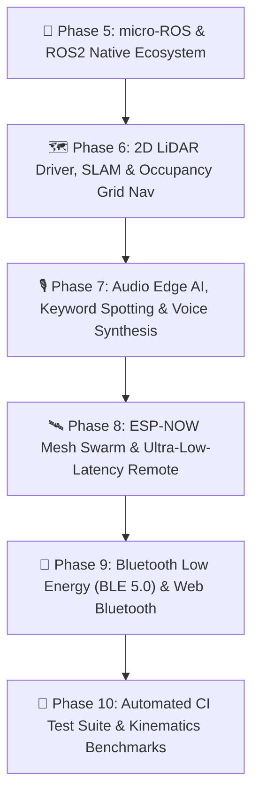

# 🌌 Future Horizons: Master Roadmap & Blueprint

This document outlines the master development roadmap for the next generation of **Tamimystic OS** on the **ESP32-S3-N16R8** architecture.

---

## 🧭 Master Roadmap Overview

---

## 🚀 Phase 5: micro-ROS & ROS2 Native Distributed Robotics

* **DDS Transport Layer**: Asynchronous UDP over Wi-Fi / Serial transport communicating with the `micro-ros-agent`.
* **Execution Model**: Dedicated FreeRTOS micro-ROS executor task running on **Core 0**.
* **Standard ROS2 Topics**:
  - `/cmd_vel` (`geometry_msgs/msg/Twist`): Inbound velocity commands routed directly to Kinematics Engine.
  - `/odom` (`nav_msgs/msg/Odometry`): Outbound wheel odometry with dead-reckoning & covariance matrix.
  - `/joint_states` (`sensor_msgs/msg/JointState`): Live 6-DOF robotic arm joint angles ($J_1 - J_6$) & velocities.
  - `/imu/data` (`sensor_msgs/msg/Imu`): Filtered 6-axis accelerometer & gyroscope data from MPU-6050.
  - `/camera/image/compressed` (`sensor_msgs/msg/CompressedImage`): DVP camera JPEG stream for ROS2 RViz visualization.
  - `/scan` (`sensor_msgs/msg/LaserScan`): 360° distance range data from 2D LiDAR.

---

## 🗺️ Phase 6: 2D LiDAR Driver, SLAM & Occupancy Grid Navigation

* **Hardware Support**: UART DMA driver for affordable 360° 2D LiDARs (RPLiDAR A1/A2, LD19 / D300, YDLidar X2/X4).
* **2D Occupancy Grid Map**:
  - Memory footprint allocated in **8MB Octal PSRAM**: $200 \times 200$ grid cells ($10\text{ m} \times 10\text{ m}$ @ $5\text{ cm/cell}$ resolution).
  - Fast Bresenham ray-casting algorithm to update cell probabilities (Free, Occupied, Unknown).
* **Real-Time Path Planning**:
  - **Global Planner**: $A^*$ (A-Star) search algorithm for optimal shortest path generation.
  - **Local Obstacle Avoidance**: Dynamic Window Approach (DWA) to steer around sudden moving obstacles.
* **Live Web Map Visualization**:
  - Real-time 2D Canvas rendering on the Web Dashboard showing the robot position, orientation heading, and live laser scan points.

---

## 🎙️ Phase 7: Audio Edge AI, Voice Control & Speech Synthesis

* **Hardware Interface**:
  - **Audio Input**: I2S DMA driver for digital MEMS microphone (INMP441 / SPH0645).
  - **Audio Output**: I2S DAC amplifier (MAX98357A / PCM5102) connected to a 3W speaker.
* **Neural Wake-Word & Keyword Spotting (KWS)**:
  - Quantized TensorFlow Lite Micro audio classification model running on **Core 1**.
  - Recognized Voice Commands: *"Hey Tamimystic"*, *"Drive Forward"*, *"Stop"*, *"Turn Left"*, *"Grab Object"*.
* **Speech Feedback & Sound Effects**:
  - Embedded PCM audio synthesizer for voice confirmations, obstacle beeps, and audio alerts.

---

## 🛰️ Phase 8: ESP-NOW Mesh Swarm Robotics & Handheld Controller Bridge

* **ESP-NOW Peer-to-Peer Protocol**:
  - Connectionless 2.4GHz RF protocol operating concurrently alongside standard Wi-Fi station mode ($<4\text{ ms}$ latency).
* **Companion Wireless Gamepad / Remote**:
  - Firmware profile for a companion ESP32 handheld controller with dual analog joysticks and OLED HUD.
* **Multi-Robot Swarm Coordination**:
  - **Leader-Follower Formation**: Master robot broadcasts its $(X, Y, \theta)$ odometry; slave robots maintain designated geometric offsets automatically.

---

## 📱 Phase 9: Bluetooth Low Energy (BLE 5.0) & Web Bluetooth Mobile App

* **NimBLE GATT Server**:
  - Lightweight BLE stack consuming $< 25\text{ KB}$ RAM.
  - Custom Robotics Service UUID for real-time Joystick Twist $(v_x, v_y, \omega)$, arm joints, and live telemetry.
* **Web Bluetooth Companion Web App**:
  - Connects directly from Chrome / Safari on Android and iOS devices without downloading apps from app stores.

---

## 🧪 Phase 10: Automated CI Test Suite & Kinematics Benchmarks

* **CTest & Native Simulator Suite**:
  - Unit tests for Inverse Kinematics analytical convergence ($100\%$ valid pose recovery).
  - Mecanum matrix transformation verification.
  - Event Bus thread-safety and latency stress tests.
  - LittleFS flash wear and file-integrity assertions.
