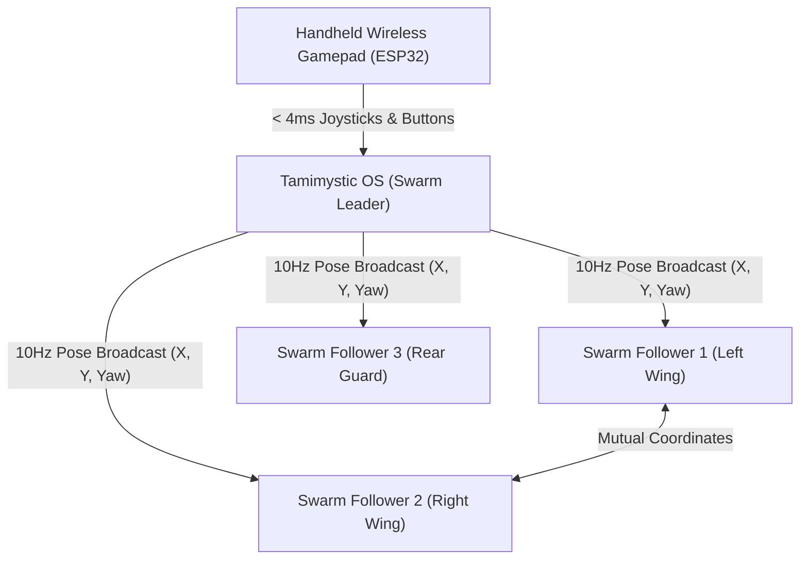

# ESP-NOW Mesh Swarm Robotics and Wireless Remote Controller

Tamimystic OS features a real-time **2.4GHz ESP-NOW Mesh Swarm & Low-Latency Remote Control Subsystem** designed for distributed multi-robot swarm intelligence and direct wireless gamepad teleoperation with sub-4ms response latency.

---

## Technical Overview and Protocol Architecture

**ESP-NOW** is a connectionless 2.4GHz RF communication protocol developed by Espressif that enables high-speed, point-to-point and point-to-multipoint packet exchanges without requiring a central Wi-Fi access point or router infrastructure.



### Core Specifications

| Metric | Specification |
|---|---|
| **RF Frequency Band** | 2.4 GHz ISM Band (Channels 1 to 14) |
| **Transport Protocol** | IEEE 802.11 Vendor-Specific Action Frames |
| **Transmission Latency** | $< 4\text{ ms}$ round-trip time |
| **Payload Capacity** | Up to 250 bytes per frame |
| **Swarm Update Rate** | 50 Hz background execution task on **Core 0** |
| **Coexistence** | Runs concurrently alongside Wi-Fi Station and Web Server |

---

## Multi-Robot Swarm Coordination and Formations

Tamimystic OS implements autonomous Leader-Follower kinematics where the master robot broadcasts its global $(X_L, Y_L, \theta_L)$ coordinates derived from odometry and SLAM, and slave robots automatically maintain relative geometric offsets.

### Geometric Formation Formulations

Given leader position $(X_L, Y_L)$, heading orientation $\theta_L$ (in radians), and inter-robot spacing distance $d$:

$$\begin{aligned}
X_{\text{target}} &= X_L + \Delta x' \cos(\theta_L) - \Delta y' \sin(\theta_L) \\
Y_{\text{target}} &= Y_L + \Delta x' \sin(\theta_L) + \Delta y' \cos(\theta_L)
\end{aligned}$$

Where the slot offset $(\Delta x', \Delta y')$ is determined by the active formation:

#### 1. Triangle (V-Shape) Formation
* **Slot 1 (Left Wing)**: $\Delta x' = -d \cos(30^\circ)$, $\Delta y' = +d \sin(30^\circ)$
* **Slot 2 (Right Wing)**: $\Delta x' = -d \cos(30^\circ)$, $\Delta y' = -d \sin(30^\circ)$
* **Slot 3 (Rear Guard)**: $\Delta x' = -1.5 \cdot d$, $\Delta y' = 0$

#### 2. Line (Trail Behind) Formation
* **Slot $k$**: $\Delta x' = -k \cdot d$, $\Delta y' = 0$

#### 3. Column (Side-by-Side) Formation
* **Slot 1 (Left)**: $\Delta x' = 0$, $\Delta y' = +d$
* **Slot 2 (Right)**: $\Delta x' = 0$, $\Delta y' = -d$

#### 4. Diamond Guard Formation
* **Slot 1 (Left)**: $\Delta x' = -d$, $\Delta y' = +d$
* **Slot 2 (Right)**: $\Delta x' = -d$, $\Delta y' = -d$
* **Slot 3 (Rear)**: $\Delta x' = -2d$, $\Delta y' = 0$

---

## Handheld Companion Remote Controller Profile

Tamimystic OS provides a dedicated companion controller firmware profile for an ESP32 handheld gamepad equipped with dual 2-axis analog joysticks, push buttons, and an I2C OLED telemetry display.

### Controller Hardware Configuration

* **MCU**: ESP32 / ESP32-S3 Mini Module
* **Left Joystick**: Linear velocity ($v_x$) and Mecanum strafe ($v_y$) (ADC Pins: GPIO 34, 35)
* **Right Joystick**: Angular yaw rotation ($\omega_z$) (ADC Pin: GPIO 32)
* **Buttons**:
  * **BTN 1 (Bit 0)**: Emergency Brake / Hardware Stop
  * **BTN 2 (Bit 1)**: Reset Arm to Home Pose
  * **BTN 2 (Bit 2)**: Toggle Robotic Gripper (Open / Close)
* **OLED HUD (SSD1306)**: Live robot battery %, speed, and RSSI signal level.

### Binary Packet Structure (`RemoteJoystickPacket`)

```c
#pragma pack(push, 1)
struct RemoteJoystickPacket {
    uint8_t  packet_type;          // 0x01 = REMOTE_JOYSTICK
    uint8_t  controller_id;        // Transmitter ID
    int8_t   axis_vx;              // Linear velocity X (-100 to +100%)
    int8_t   axis_vy;              // Linear velocity Y (-100 to +100%)
    int8_t   axis_omega;           // Angular rotation (-100 to +100%)
    uint8_t  buttons;              // Bitmask: [0:E-Stop, 1:Arm Home, 2:Gripper]
    uint16_t arm_joint_target[6];  // 6-DOF joint targets in 0.1 deg
    uint32_t timestamp_ms;         // Monotonic timestamp
    uint32_t sequence;             // Packet counter
};
#pragma pack(pop)
```

---

## C++ Engine API Reference

```cpp
#include "os_espnow.h"

using namespace TamimysticOS;

// 1. Initialize ESP-NOW subsystem and 50Hz background task
EspNowEngine::getInstance().init();

// 2. Configure Swarm Role
// Options: SwarmRole::STANDALONE, SwarmRole::LEADER, SwarmRole::FOLLOWER
EspNowEngine::getInstance().setSwarmRole(SwarmRole::FOLLOWER, /* slot */ 1, /* spacing_cm */ 60.0f);

// 3. Set Formation Pattern (when in Leader mode)
EspNowEngine::getInstance().setFormation(SwarmFormation::TRIANGLE, 75.0f);

// 4. Enable Wireless Gamepad Remote Control Listening
EspNowEngine::getInstance().setRemoteControlEnabled(true);

// 5. Send Custom Message to a Specific MAC
EspNowEngine::getInstance().sendCustomPayload("24:DC:C3:98:45:01", "SYNC_START");
```

---

## HTTP REST API Endpoints

All endpoints are available on Port 80 (ESP32) and Port 8080 (PC Simulator):

| Method | Endpoint | Description |
|---|---|---|
| `GET` | `/api/espnow/status` | Returns JSON status of ESP-NOW radio, swarm role, and packet metrics. |
| `GET` | `/api/espnow/peers` | Lists all paired robots, RSSI signal strength, and last known poses. |
| `POST` | `/api/espnow/swarm` | Configures swarm role (`role=leader\|follower\|standalone`), formation, slot, and spacing. |
| `POST` | `/api/espnow/remote` | Toggles wireless gamepad receiver mode (`enable=1\|0`). |
| `POST` | `/api/espnow/send` | Transmits custom payload to peer (`mac=XX:XX:..&msg=...`). |

---

## Serial CLI Commands

```text
tamimystic> espnow status
=== ESP-NOW 2.4GHz Radio & Swarm Mesh Status ===
  MAC Address      : 24:DC:C3:98:45:A0
  Wi-Fi Channel    : 1
  Swarm Role       : FOLLOWER
  Formation        : TRIANGLE
  Follower Slot    : 1
  Formation Spacing: 60.0 cm
  Remote Control   : ACTIVE (Listening)
  Packets Sent     : 1420
  Packets Received : 1418
  Average Latency  : 2.1 ms
  Active Peers     : 2

tamimystic> espnow peers
=== Active ESP-NOW Mesh Peers (2) ===
  [0] MAC: 24:DC:C3:98:45:01 | RSSI: -52 dBm | Role: LEADER | Robot ID: 1 | Pose: (120.0, 80.0 cm)
  [1] MAC: 24:DC:C3:98:45:02 | RSSI: -60 dBm | Role: FOLLOWER | Robot ID: 2 | Pose: (60.0, 20.0 cm)

tamimystic> espnow swarm follower 1 60.0
[ESPNOW] Swarm Role Changed: FOLLOWER | Slot: 1 | Spacing: 60 cm

tamimystic> espnow remote on
[ESPNOW] Wireless Handheld Gamepad Remote Control ENABLED
```

---

## MicroPython Scripting Example

```python
import tamimystic
import time

# Configure robot as Swarm Follower (Slot 1, 50cm spacing)
tamimystic.espnow.swarm("follower", 1, 50.0)

# Enable Gamepad Remote listening
tamimystic.espnow.remote(True)

# Send custom coordination message to swarm leader
tamimystic.espnow.send("24:DC:C3:98:45:01", "FOLLOWER_READY")

print("ESP-NOW Swarm Follower task active.")
```
