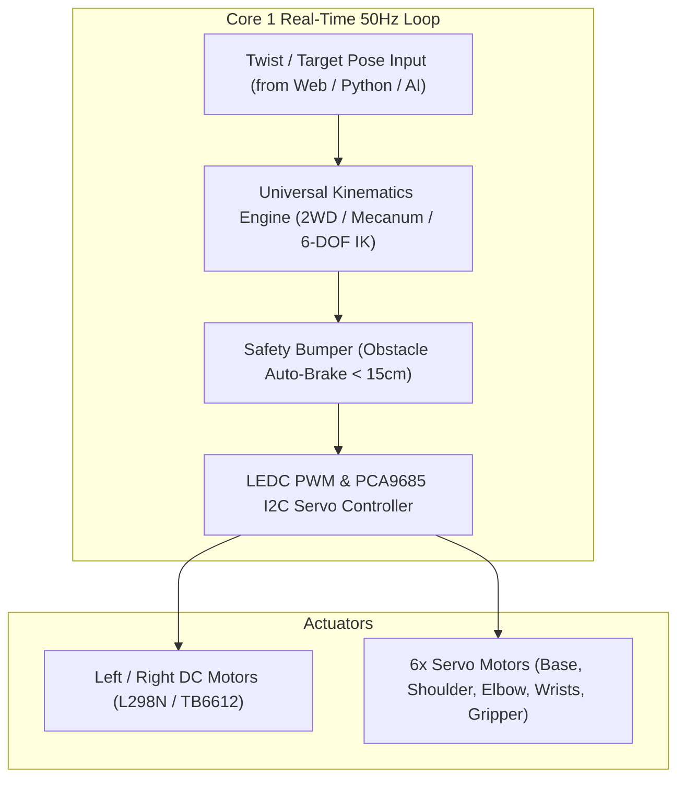

# 🦾 Universal Robot Brain Architecture

Tamimystic OS features a real-time, deterministic robotics control engine executed on a dedicated high-priority FreeRTOS task running on **Core 1 @ 50 Hz** (20ms loop period).

---

## 🏗️ Robotics Subsystem Architecture



---

## 🛡️ Core Safety Features

### 1. Virtual Proximity Bumper (< 15cm Auto-Brake)
The 50Hz control loop constantly reads the front obstacle distance from the VL53L0X Time-of-Flight or Ultrasonic sensor.
* If distance is **$< 15\text{ cm}$** and the commanded linear velocity is **forward ($v_x > 0$)**, the OS immediately overrides the motor commands to 0% duty cycle, preventing collision.
* The user is still permitted to command backward motion ($v_x < 0$) or turn away ($\omega$) to escape the obstacle.

### 2. Hardware & Software Emergency Stop (E-Stop)
* A dedicated E-Stop flag is exposed via serial CLI (`robot stop`), HTTP API (`/api/robot/stop`), Web Dashboard button, and Python (`tamimystic.robot.stop()`).
* When engaged, all PWM outputs and H-bridge direction pins drop to LOW instantly.

---

## 🎛️ Supported Robot Modes

| Mode Name | Identifier | Wheels / Actuators | Primary Control Command |
|---|---|---|---|
| **Differential Rover** | `diff` | 2WD / 4WD standard differential steering | `robot move <linear> <angular>` |
| **Mecanum Holonomic** | `mecanum` | 4WD Mecanum rollers ($45^\circ$) | `robot strafe <vx> <vy> <omega>` |
| **6-DOF Robotic Arm** | `arm` | 6x Servos (Base, Shoulder, Elbow, Wrist Pitch, Wrist Roll, Gripper) | `robot arm <j1> <j2> <j3> <j4> <j5> <j6>` or `robot ik <x> <y> <z>` |
| **Self-Balancing Bot** | `balance` | 2WD High-Torque Motors + MPU-6050 IMU | 200Hz Inverted Pendulum PID Loop |

---

## 💻 CLI Safety Commands

```bash
# Emergency Stop immediately
aeron> robot stop

# Release Emergency Stop and resume operation
aeron> robot resume

# Inspect live telemetry JSON
aeron> robot status
```
