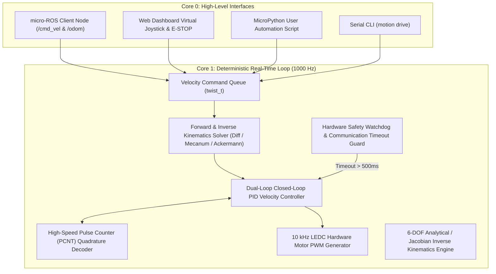
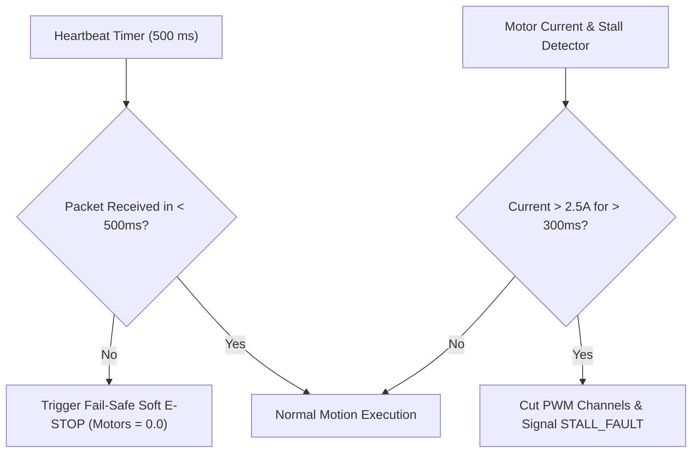

# Universal Robot Brain Architecture

Tamimystic OS provides an integrated **Universal Robot Brain** (`os_motion`, `os_arm`, `os_slam`, `os_ros2`) that unifies multi-kinematics mobile rover navigation, 6-DOF robotic arm manipulation, 2D LiDAR SLAM, and ROS 2 ecosystem connectivity into a single, deterministic embedded operating system running on the ESP32-S3.

---

## Real-Time Deterministic Control Architecture

The robotics control subsystem is pinned to **Core 1** of the ESP32-S3 to prevent jitter, network latency spikes, or garbage collection pauses from disrupting motor motion loops:



---

## 1000 Hz Closed-Loop Motion Controller

The motion loop executes every $1.0\text{ ms}$ ($\Delta t = 0.001\text{ s}$) with sub-microsecond timing precision:

### Dual-Loop PID Control Equation:
$$u(t) = K_p \cdot e(t) + K_i \int_0^t e(\tau) d\tau + K_d \frac{de(t)}{dt} + K_{ff} \cdot v_{\text{target}}$$

Where:
- $e(t) = v_{\text{target}}(t) - v_{\text{actual}}(t)$ is the wheel velocity error.
- $K_p, K_i, K_d$ are user-tunable Proportional, Integral, and Derivative gains.
- $K_{ff}$ is the Feed-Forward gain derived from the DC motor voltage-speed constant ($K_v$) to reduce response latency.
- Anti-windup clamping prevents integral saturation during high acceleration or wheel stalls.

---

## Supported Robotics Chassis Kinematics

Tamimystic OS provides native kinematic solvers for four distinct ground robot topologies:

| Chassis Topology | Supported Wheels | Degrees of Freedom | Primary Characteristics |
|---|---|---|---|
| **Differential Drive** | 2 Drive Wheels + 1 Caster | 2-DOF ($v_x, \omega_z$) | Standard rover, zero turning radius, simple mechanical structure. |
| **Mecanum Omnidirectional** | 4 Mecanum 45-degree rollers | 3-DOF ($v_x, v_y, \omega_z$) | Holonomic motion: translate sideways, forward, and rotate simultaneously. |
| **Ackermann Steering** | 2 Drive Wheels + 1 Steering Servo | 2-DOF ($v_x, \delta$) | Automotive car-like steering geometry, smooth high-speed stability. |
| **4-Wheel Skid Steer** | 4 Standard Drive Wheels | 2-DOF ($v_x, \omega_z$) | All-terrain outdoor rovers, robust high-traction turning. |

---

## 6-DOF Robotic Arm Manipulation

The robotic arm subsystem (`os_arm`) controls multi-joint manipulators using standard PWM RC servos driven via direct GPIO LEDC or I2C PCA9685 expansion:

- **Degrees of Freedom**: Base Yaw ($J_1$), Shoulder Pitch ($J_2$), Elbow Pitch ($J_3$), Wrist Pitch ($J_4$), Wrist Roll ($J_5$), and Gripper Claw ($J_6$).
- **Inverse Kinematics**: Solves target end-effector Cartesian coordinates $(X, Y, Z, \text{Roll}, \text{Pitch}, \text{Yaw})$ into individual joint angles ($\theta_1 \dots \theta_6$) in under $0.8\text{ ms}$.
- **Trajectory Interpolation**: Generates smooth 5th-order polynomial (Quintic) trajectories to eliminate sudden acceleration jerks and mechanical vibration.

---

## Fail-Safe Safety Architecture

To protect physical hardware, operators, and environments, the kernel enforces multiple hardware safety guards:



1. **Communication Timeout Fail-Safe**: If no motion command is received via Wi-Fi, micro-ROS, or CLI for $> 500\text{ ms}$, the motor outputs immediately decay to zero.
2. **Physical E-STOP Button**: Instantaneous interrupt-driven hardware cutoff mapped to an optional digital input pin.
3. **Stall Protection**: Monitors quadrature encoder pulse rates; if PWM is applied but zero pulses are counted for $> 300\text{ ms}$, power is cut to prevent driver burnout.

---

## MicroPython Robotics Scripting Example

```python
import tamimystic
import time

# Configure Mecanum Chassis
tamimystic.motion.set_type("mecanum")
tamimystic.motion.set_pid(kp=1.2, ki=0.05, kd=0.01)

# Strafe left at 0.3 m/s for 1.5 seconds (Holonomic motion)
tamimystic.motion.drive_holonomic(vx=0.0, vy=-0.3, omega=0.0)
time.sleep(1.5)

# Move 6-DOF Arm to Pick Position (X=180mm, Y=0mm, Z=45mm)
tamimystic.arm.move_to(x=180.0, y=0.0, z=45.0, pitch=45.0)
time.sleep(1.0)

# Close Gripper Claw
tamimystic.arm.set_gripper(80) # 80% Grip force
time.sleep(0.5)

# Lift object to Safe Transit Height
tamimystic.arm.move_to(x=180.0, y=0.0, z=150.0, pitch=0.0)
```

---

## Serial CLI and REST API Reference

### Serial CLI:
```bash
# Set chassis type to Mecanum
tamimystic> motion type mecanum

# Drive forward at 0.5 m/s with 0.2 rad/s rotation
tamimystic> motion drive 0.5 0.2

# Trigger emergency stop
tamimystic> motion stop

# Query motion telemetry and odometry
tamimystic> motion status
```

### HTTP REST API:
```bash
# Drive command
POST /api/motion/drive?linear=0.5&angular=0.0

# Emergency Stop
POST /api/motion/stop

# Get Motion and Odometry State
GET /api/motion/status
```
