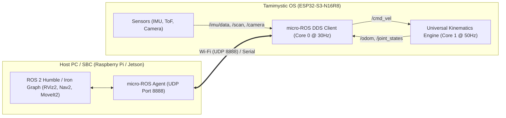

# micro-ROS and ROS 2 Distributed Robotics

Tamimystic OS provides a native **micro-ROS (Micro XRCE-DDS)** client implementation running directly on the ESP32-S3 (or Native PC Simulator), enabling seamless bidirectional integration with ROS 2 (Robot Operating System) distributions including **Humble, Iron, and Jazzy**.

---

## Architecture Overview



* **Zero Middleware Overhead**: The micro-ROS client communicates directly with the `micro-ros-agent` using standard DDS protocols without requiring a heavy bridge.
* **Core 0 Pinned**: The ROS 2 DDS executor task runs on Core 0, leaving Core 1 exclusively dedicated to 50Hz real-time kinematics and Edge AI neural inference.
* **Non-Blocking Fallback**: If the micro-ROS agent is offline or loses connection, the OS continues running autonomously with manual web/joystick controls.

---

## Standard ROS 2 Topics

| Topic Name | Message Type | Role | Rate | Description |
|---|---|---|---|---|
| `/cmd_vel` | `geometry_msgs/msg/Twist` | Subscriber | 50 Hz | Inbound velocity commands routed directly to the Kinematics Engine. |
| `/odom` | `nav_msgs/msg/Odometry` | Publisher | 30 Hz | Outbound dead-reckoning odometry and $(X, Y, \theta)$ position. |
| `/joint_states` | `sensor_msgs/msg/JointState` | Publisher | 30 Hz | Live 6-DOF robotic arm joint angles ($J_1 - J_6$) in radians. |
| `/imu/data` | `sensor_msgs/msg/Imu` | Publisher | 50 Hz | 6-axis accelerometer, gyroscope, and orientation quaternion from MPU-6050. |
| `/scan` | `sensor_msgs/msg/LaserScan` | Publisher | 10 Hz | 360-degree distance range scan data. |
| `/camera/image/compressed` | `sensor_msgs/msg/CompressedImage` | Publisher | 15 Hz | Live JPEG stream from the DVP camera for RViz visualization. |

---

## Setting Up the micro-ROS Agent

To bridge Tamimystic OS with your ROS 2 environment, launch the official micro-ROS agent on your computer or SBC (Raspberry Pi, Jetson):

### Using Docker (Recommended):
```bash
# Run micro-ROS agent listening on UDP port 8888
docker run -it --rm --net=host microros/micro-ros-agent:humble udp4 --port 8888 -v6
```

### Using Native ROS 2 Workspace:
```bash
# Source ROS 2 environment
source /opt/ros/humble/setup.bash

# Run the agent
ros2 run micro_ros_agent micro_ros_agent udp4 --port 8888
```

---

## Connecting Tamimystic OS to the Agent

### Method 1: Via Web Dashboard
1. Open `http://<device-ip>/` in your web browser.
2. Scroll to the **micro-ROS and ROS 2 Node** card.
3. Enter your Host PC IP address (e.g., `192.168.1.100`), Port `8888`, and Domain ID `0`.
4. Click **Connect Agent**.
5. The status badge will switch to **RUNNING**.

### Method 2: Via Serial CLI
```bash
# Connect to agent at 192.168.1.100 on port 8888, domain 0
aeron> ros2 connect 192.168.1.100 8888 0

# Check node status and active topic statistics
aeron> ros2 status

# Disconnect from agent
aeron> ros2 disconnect
```

---

## Interacting with the Robot from ROS 2

Once connected, open a terminal on your ROS 2 PC:

### 1. View Active Nodes and Topics
```bash
# List all active ROS 2 nodes
ros2 node list
# Output: /tamimystic_os_node

# List active topics
ros2 topic list
```

### 2. Teleoperate Robot via Keyboard
```bash
# Run standard ROS 2 teleop keyboard
ros2 run teleop_twist_keyboard teleop_twist_keyboard
```

### 3. Echo Live Odometry & Telemetry
```bash
# View live odometry stream
ros2 topic echo /odom

# View live IMU data
ros2 topic echo /imu/data

# View 6-DOF robotic arm joint states
ros2 topic echo /joint_states
```

### 4. Visualize in RViz2
Launch RViz2 to visualize the robot's coordinate frame (`odom` -> `base_link`), live camera image, and laser scans:
```bash
rviz2
```
Add displays for:
* **TF**: Shows live transformation tree.
* **Odometry**: Target topic `/odom`.
* **Image**: Target topic `/camera/image/compressed`.
* **LaserScan**: Target topic `/scan`.

---

## Python Scripting with ROS 2

You can also interact with the ROS 2 subsystem from within your onboard Python scripts:

```python
import tamimystic

# Check if ROS 2 DDS agent is connected
if tamimystic.ros2.is_connected():
    print("ROS 2 Agent is active!")
    tamimystic.ros2.publish_log("Robot task started via Python runtime.")
else:
    print("ROS 2 Agent offline. Running in local standalone mode.")

# Command movement
tamimystic.robot.move(50, 0)
```
